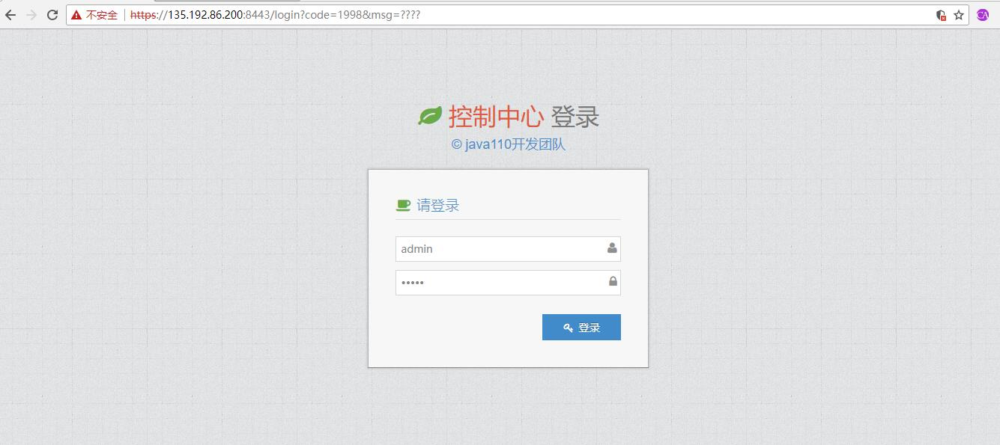
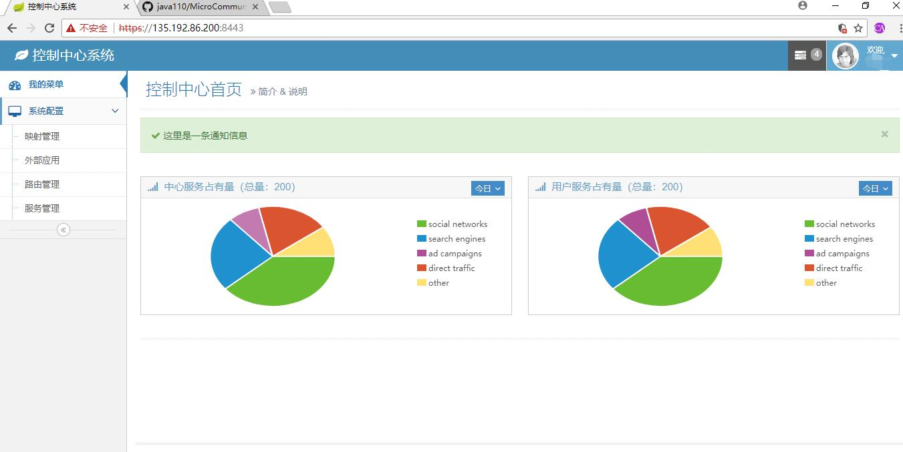
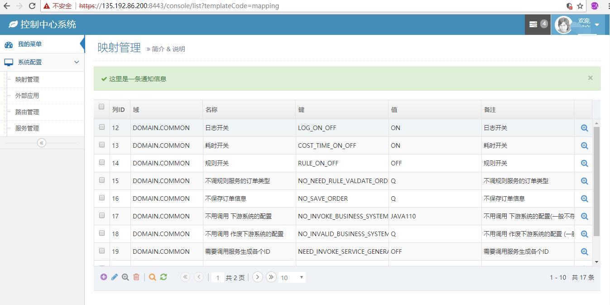
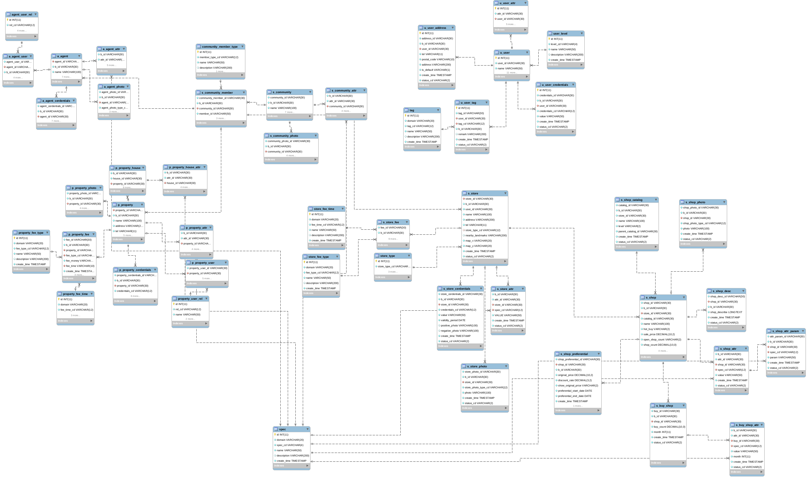

### 变更历史（change history）
版本|变更内容|变更时间|变更人员
:-: | :-: | :-: | :-:
v0.01|初稿|2018-07-24|wuxw

### 分支说明（branch）

分支管理说明，test为最新代码未测试代码（主要为了防止本地代码遗失），master 为最新测试过代码（待产品化），product 为产品化代码

### 系统简介（introduction）
1. 开发工具：

java1.8 + idea/eclipse + mysql 

2. 技术架构：

Java + spring cloud + mybatis + mysql + kafka + redis

3. 服务依赖关系

### 如何开始（how to start）

[http://www.java110.com](http://www.java110.com)

### 如何安装（how to install）

[从这里安装](docs/install.md)

### 解决方案

    [解决方案](https://docs.qq.com/doc/DQW9XWW50R3NjWmN6) 不断完善中

### 接口接口协议

1. [openApi协议](docs/api/Readme.md)

2. [后台协议](docs/services/Readme.md)

### 运行效果（view）
1.在浏览器输入 https://localhost:8443/ 如下图

    点击高级，继续前往。

2.登录系统，用户名为 wuxw 密码为 admin  如下图

    点击登录，进入如下图：
    
  
  
  
  
  

3.统一接口地址：http://ip:8001/httpApi/service

4.数据模型图

加入微小区交流群随时了解项目进度，和java110开发者零距离沟通 qq群号 827669685，邮箱：928255095@qq.com

