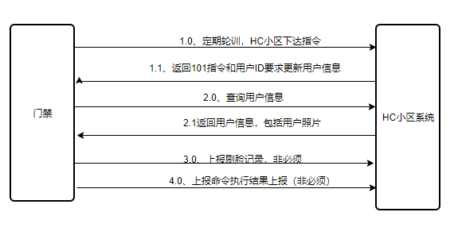

# HC小区管理系统是前后端完全开源的小区物业管理系统，包含小区后端项目，小区前段项目，物业版APP和业主版小程序,最新SQL文件加群获取827669685

## 开源代码说明

### HC小区后端代码
 [https://gitee.com/wuxw7/MicroCommunity](https://gitee.com/wuxw7/MicroCommunity)
### HC小区前段代码
[https://gitee.com/java110/MicrCommunityWeb](https://gitee.com/java110/MicrCommunityWeb)
### HC智慧家庭（业主版）
[https://gitee.com/java110/WechatOwnerService](https://gitee.com/java110/WechatOwnerService)
### HC掌上物业（物业版）
[https://gitee.com/java110/PropertyApp](https://gitee.com/java110/PropertyApp)

### 分支说明（branch）

分支管理说明，master 为前后端未分离代码，back  为前后端分离后端代码

### 系统简介（introduction）
1. 开发工具：

java1.8 + idea/eclipse + mysql + redis

2. 官方网站
   http://www.homecommunity.cn
   
   技术业务交流群QQ: 827669685

3. 硬件要求:

   测试环境基本要求：4个CPU 、16G内存和80G硬盘
   
4. 软件要求:

    需要自行安装 mysql5.6、zookeeper、Redis和kafka
    
    需要启动的服务，可以查看 reBuildAll.sh,目前基本为：eureka、Api、OrderService、CommunityService、StoreService、UserService
    FrontService、FeeService和CommonService
    
    推荐用docker部署管理，需要安装docker、docker-compose （如果夸主机部署请用docker swarm 自行创建java110-net network），
    如果是单机推荐直接运行 reBuildAll.sh
    
### 业主小程序

   
    
   github: [https://github.com/java110/WechatOwnerService](https://github.com/java110/WechatOwnerService)
   
   gitee: [https://gitee.com/java110/WechatOwnerService](https://gitee.com/java110/WechatOwnerService)
    
### 系统功能（function） 

   
   
   主要系统功能请查看
     
   [http://www.homecommunity.cn//document/#/func/funcation](http://www.homecommunity.cn//document/#/func/funcation)
  

### 演示地址（demo）

[http://www.homecommunity.cn/](http://www.homecommunity.cn/)

物业 账号/密码：wuxw/admin

代理商 账号/密码：dails/admin

运维团队 账号/密码：admin/admin

开发团队 账号/密码：dev/(由于开发者权限较大，删除数据会影响稳定性，查看具体功能，可以单独部署查看)

### 如何开始（how to start）

[http://www.homecommunity.cn/](http://www.homecommunity.cn/)

### 如何安装（how to install）

[安装文档](http://www.homecommunity.cn//document/#/start/dev_install)

### 解决方案

[解决方案](https://docs.qq.com/doc/DQW9XWW50R3NjWmN6) 不断完善中

### 硬件接入

目前对接锐目门禁系统，如果您想将您的硬件对接到此项目，请加qq群号827669685 联系我们

### 二次开发视频

[视频](http://www.homecommunity.cn//document/#/start/vedio)

### 接口协议

1. [Api协议](http://www.homecommunity.cn//document/#/api/user/register)

2. [后台协议](http://www.homecommunity.cn//document/#/dictionary)

### 运行效果（view）
1.在浏览器输入 https://localhost:8443/ 如下图

    用户名为 wuxw 密码为 admin  如下图

    点击登录，进入如下图：
    

2.数据模型图

### 加入我们（join）

加入微小区交流群随时了解项目进度，和java110开发者零距离沟通 qq群号 827669685，邮箱：928255095@qq.com

### 成为开发者

如果您对小区 物业 有较深的理解，也致力于开发一套系统方便与物业，业主沟通交流，如果您还有空闲的时间，不怕吃苦，hc小区开发团队欢迎您的加入！
qq群号 992420128  微信：wuxw2977 （添加时请备注HC小区开发）

