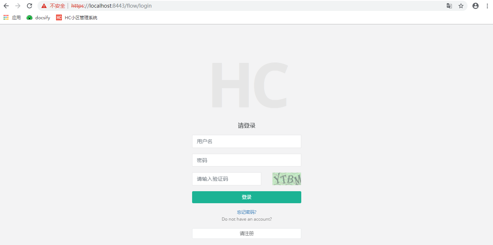
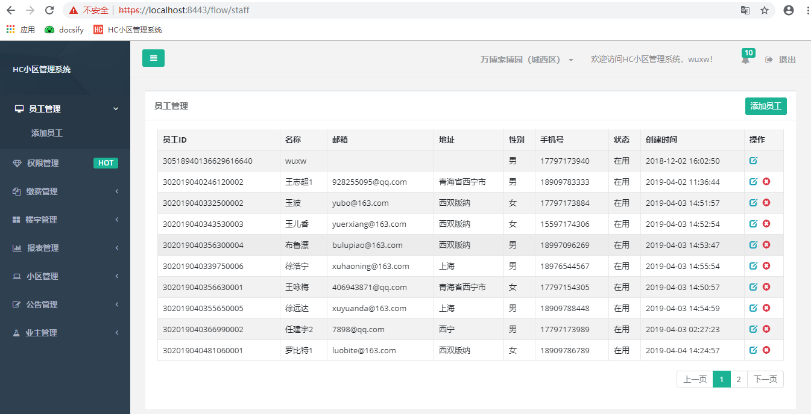
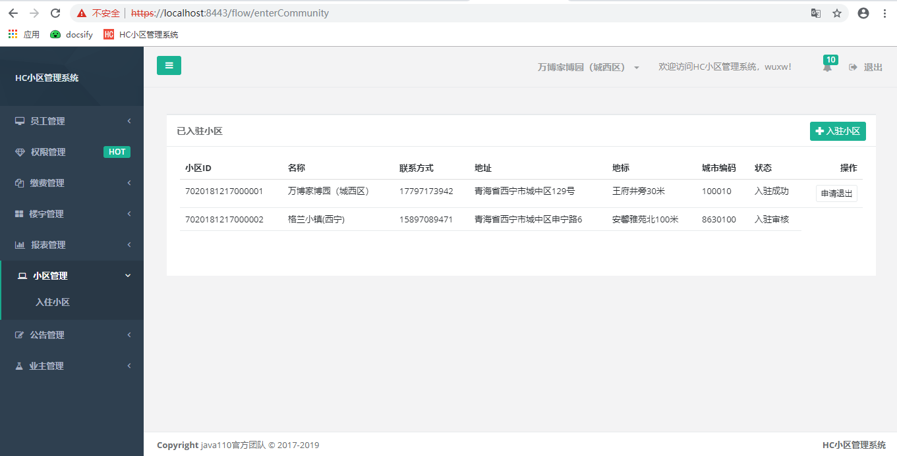

### 变更历史（change history）
版本|变更内容|变更时间|变更人员
:-: | :-: | :-: | :-:
v0.01|初稿|2018-07-24|wuxw

### 代码分享视频

1、[安装视频](http://www.iqiyi.com/w_19s9dzcnp9.html)

2、[小区管理系统源码讲解](http://www.iqiyi.com/w_19s7u6le2p.html#vfrm=16-1-1-1)

3、[小区管理系统服务端开发视频](http://www.iqiyi.com/w_19s7omicex.html#curid=38432723509_ef5ddb9c572fa848bcdd80f193d78eeb)

### 分支说明（branch）

分支管理说明，test为最新代码未测试代码（主要为了防止本地代码遗失），master 为最新测试过代码（待产品化），product 为产品化代码

### 系统简介（introduction）
1. 开发工具：

java1.8 + idea/eclipse + mysql 

2. 技术架构：

Java + spring cloud + mybatis + mysql + kafka + redis

3. 服务依赖关系

### 演示地址（demo）

[https://demo.java110.com](https://demo.java110.com)

账号/密码：wuxw/admin

### 如何开始（how to start）

[http://www.java110.com](http://www.java110.com)

### 如何安装（how to install）

[安装文档](http://www.java110.com/#/start/dev_install)

### 解决方案

[解决方案](https://docs.qq.com/doc/DQW9XWW50R3NjWmN6) 不断完善中

### 二次开发视频

[视频](https://www.java110.com/#/start/vedio)

### 接口协议

1. [Api协议](https://www.java110.com/#/api/user/register)

2. [后台协议](https://www.java110.com/#/dictionary)

### 运行效果（view）
1.在浏览器输入 https://localhost:8443/ 如下图

    用户名为 wuxw 密码为 admin  如下图

    点击登录，进入如下图：
    

2.数据模型图

### 加入我们（join）

加入微小区交流群随时了解项目进度，和java110开发者零距离沟通 qq群号 827669685，邮箱：928255095@qq.com

### 成为开发者

如果您对小区 物业 有较深的理解，也致力于开发一套系统方便与物业，业主沟通交流，如果您还有空闲的时间，不怕吃苦，hc小区开发团队欢迎您的加入！
qq群号 992420128

