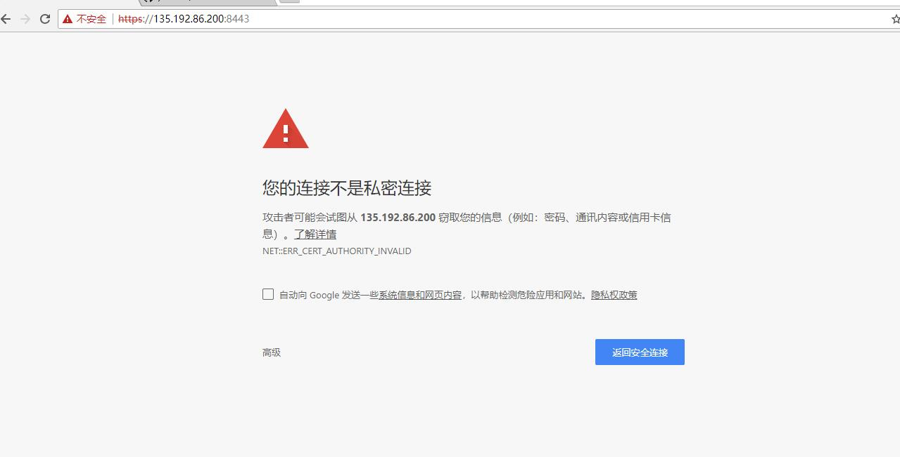
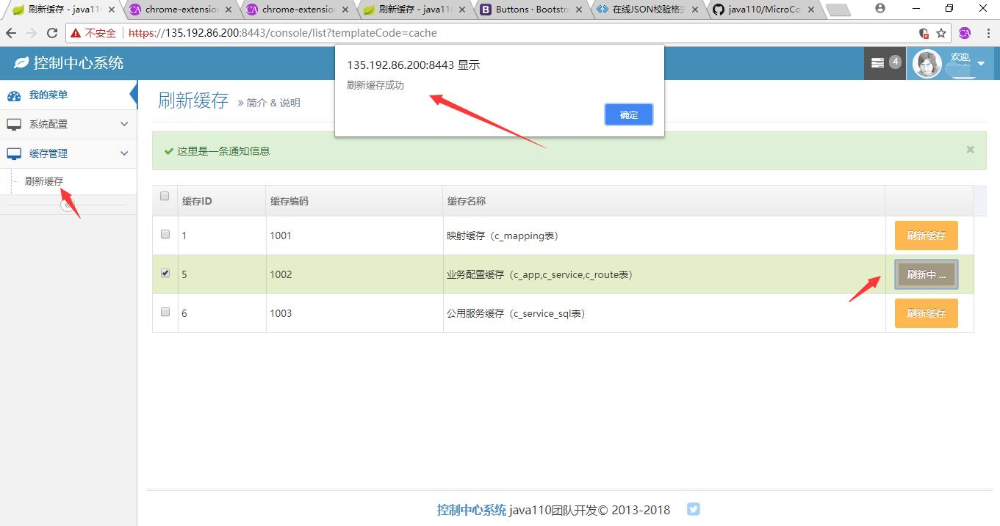

微小区平台

分支说明：

分支管理说明，test为最新代码未测试代码（主要为了防止本地代码遗失），master 为最新测试过代码（待产品化），product 为产品化代码

开发工具：

java1.8 + idea/eclipse + mysql 

技术架构：

Java + spring cloud + mybatis + mysql + kafka + redis

服务依赖关系

服务安装说明：

1、安装mysql，kafka，redis,git ,maven （详细安装请Google或百度）

2、git clone https://github.com/java110/MicroCommunity.git 下载代码

3、在相应服务下（如：CenterService 服务） src/main/application.yml 中修改mysql地址、用户名和密码、kafka地址、redis地址 

4、进入MicroCommunity 目录 执行 mvn clean install 打包

5、配置数据
    将 java110-config/db 下的CenterService 和 ConsoleService 中的create_table.db 导入数据库中
    

6、启动

    （1） 启动 eureka 命令为 java -jar eureka.jar
    （2） 启动 CenterService 命令为 java -jar CenterService.jar
    （3） 启动 ConsoleService 命令为 java -jar ConsoleService.jar

7、用post工具属性缓存 地址为：http://yourIp:8001/cacheApi/flush 如下图：

8、在浏览器输入 http://yourIp:6001/ 如下图

    点击高级，继续前往。

9、登录系统，用户名为 admin 密码为 admin  如下图

    点击登录，进入如下图：
    
  
  
  
  
  

10、统一接口地址：http://yourIp:8001/httpApi/service

加入钉钉java110 工作群随时了解项目进度，和java110开发者零距离沟通

