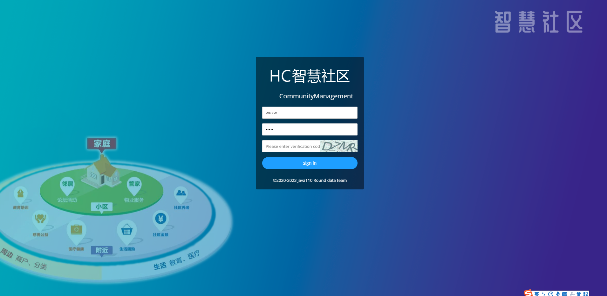
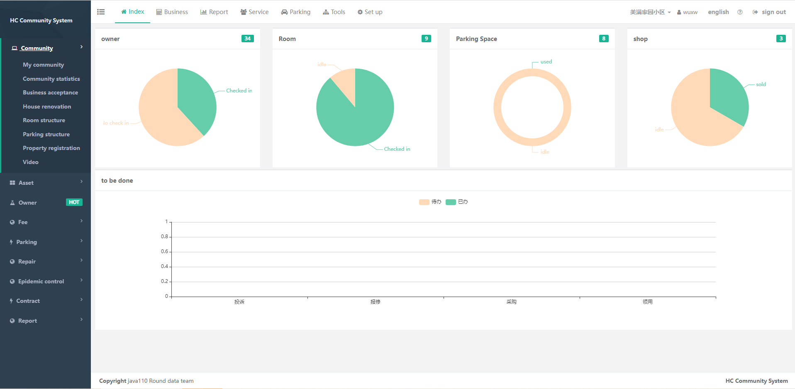
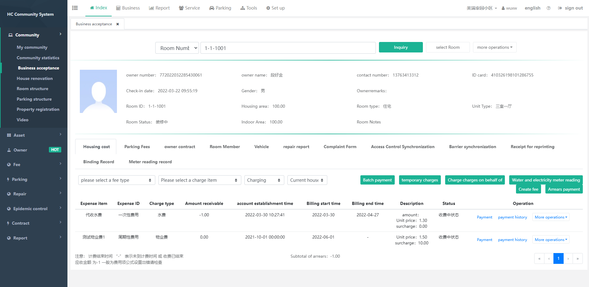
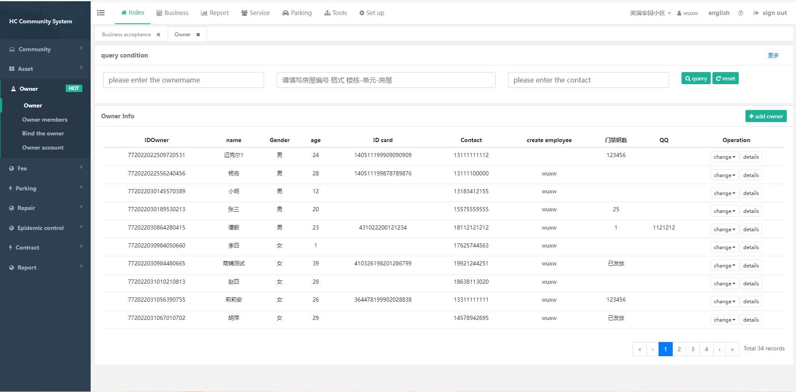

[english](Readme_en.md)|[中文](Readme_cn.md)
## Introduction
 HC community management system is a set of saas property management system, including real estate, owners, fees (payment can be made online), repair application (repair can be reported online), complaints and suggestions, procurement, inspection, parking, gates, gates, monitoring , workflow, questionnaires, and announcements.
 
 Related code：  
 1、[Front end of property system](https://gitee.com/java110/MicroCommunityWeb) : Property staff using computer terminal 
 2、[Property system backend](https://gitee.com/wuxw7/MicroCommunity): core business processing 
 3、[Owner's mobile phone](https://gitee.com/java110/WechatOwnerService): 
Provide users with use, including complaints and suggestions, payment, repairs, etc. 
 4、[Property mobile version](https://gitee.com/java110/PropertyApp): Property staff using mobile terminal 

## how to install

1、[Development environment installation](docs/installHcDev_en.md)  
2、[Production environment installation](docs/installHcProd.md) 

## how to use

[Operation Manual](https://github.com/java110/MicroCommunity/wiki)
   
## product

1、Mobile demonstration environment demo

   

2、computer demo 
url ：http://demo.homecommunity.cn  
admin account：admin/admin 
property account:wuxw/admin 
dev account：dev/Change the password yourself [How to modify](http://bbs.homecommunity.cn/pages/bbs/topic.html?topicId=102021110520080050)
    
## System functions
   
   Please check the main system functions
     
   [Feature list](http://bbs.homecommunity.cn/pages/bbs/topic.html?topicId=102022042459860343)
  
## running result（view）
1.Type in the browser http://demo.homecommunity.cn/ As shown below

    username: wuxw password: admin  As shown below

    Click to log in to enter the following picture:

## Participate and contribute

You can fork the code and pull request to merge the code after commit

