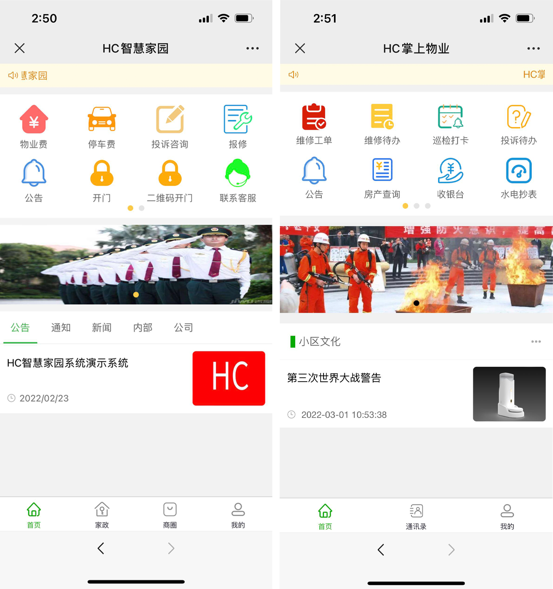

[english](Readme_en.md)|[中文](Readme_cn.md)
## 说明
 HC小区管理系统是一套saas物业管理的系统，包括 房产、业主、 费用 （可以线上缴费）、报修（可以线上报修）、投诉建议、采购、巡检、停车、门径、道闸、监控、工作流、问卷和公告等功能。

目前很多地方商用超过一年半时间 欢饮直接使用或者推广使用
 
 相关代码：  
 1、[物业系统前端](https://gitee.com/java110/MicroCommunityWeb) : 物业员工使用电脑端 
 2、[物业系统后端](https://gitee.com/wuxw7/MicroCommunity): 核心业务处理端 
 3、[业主手机端](https://gitee.com/java110/WechatOwnerService): 提供用户使用，包括投诉 建议，缴费、报修 等 
 4、[物业手机版](https://gitee.com/java110/PropertyApp): 物业员工使用手机端 

## 如何安装

1、[开发环境安装](docs/installHcDev.md)  
2、[生产环境安装](docs/installHcProd.md) 
3、[springboot方式启动](docs/installSpringboot.md) 

## 如何使用

[操作手册](http://bbs.homecommunity.cn/document.html?docId=102022031484710001)

   
## 产品

1、手机端演示环境

   

2、电脑端 
地址：http://demo.homecommunity.cn  
管理员账号：admin/admin 
物业演示账号:wuxw/admin 
开发者账号：dev/密码自己修改 [如何修改](http://bbs.homecommunity.cn/pages/bbs/topic.html?topicId=102021110520080050)
    
## 系统功能（function） 

   
   
   主要系统功能请查看
     
   [功能清单](http://bbs.homecommunity.cn/pages/bbs/topic.html?topicId=102022042459860343)
  
## 运行效果（view）
1.在浏览器输入 http://localhost:3000/ 如下图

    用户名为 wuxw 密码为 admin  如下图

    点击登录，进入如下图：

## 参与贡献

您可以fork 代码后，commit后 pull request合并代码

联系作者：17797173942（微信号）

QQ交流群8：780056134

