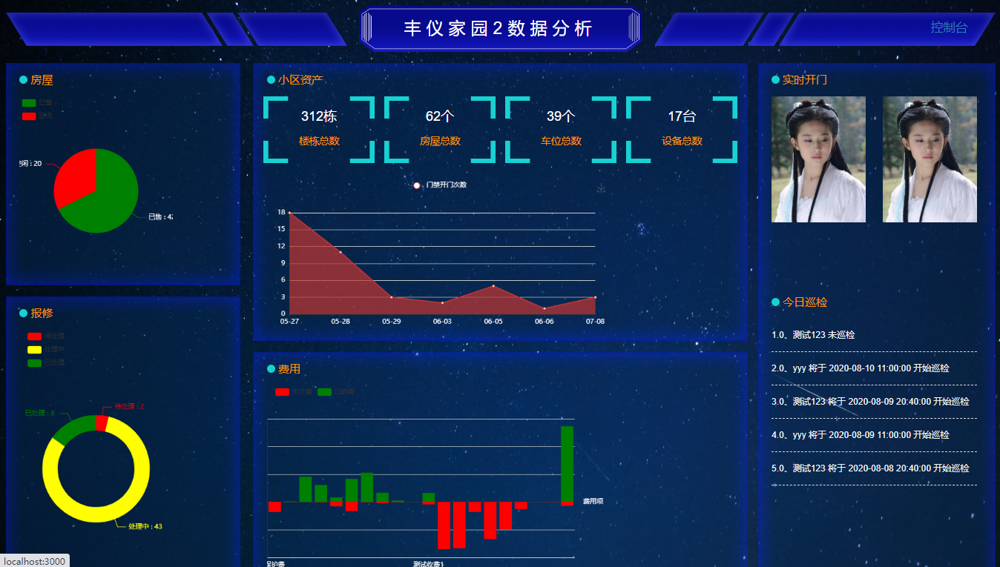

# HC community management system is an open source and free commercial community property management system, including back-end project, front-end project, property version uni app and owner's version uni app. The latest SQL file group access 827669685 (full), 799748606 (group 2)

## Open source code description

### HC cell back end code

[ https://gitee.com/wuxw7/MicroCommunity ] https://gitee.com/wuxw7/MicroCommunity )

### HC cell front end code

[ https://gitee.com/java110/MicroCommunityWeb ] https://gitee.com/java110/MicroCommunityWeb )

### HC smart home (owner version)

[ https://gitee.com/java110/WechatOwnerService ] https://gitee.com/java110/WechatOwnerService )

### HC handheld property (uni app for property)

[ https://gitee.com/java110/PropertyApp ] https://gitee.com/java110/PropertyApp )

### Branch description

Branch management Description: Master is the main branch, 0.5-stable is the latest stable branch (recommended for commercial landing version) and 0.1-stable is the front-end and back-end non separation Version (not recommended)

### How to start

[ http://www.homecommunity.cn/ ] http://www.homecommunity.cn/ )

### How to install

Scheme 1, CentOS 7.6 one button automatic installation

> yum install -y wget && wget https://dl.winqi.cn/hc/hcInstall.sh && sh hcInstall.sh Your private IP

Note: your private IP address is the intranet IP of the server. If the server has only one private IP address, it can be omitted. If there are more than one private IP address, it needs to be specified

[reference video]（ https://www.bilibili.com/video/BV1Dk4y19728/ )

Scheme 2: self service deployment according to demand

[reference video]（ https://www.bilibili.com/video/BV1N7411E7rf/ )

### Operation document

[operation document]（ http://www.homecommunity.cn/operateDoc )

### Technical documentation

[technical documents]（ http://www.homecommunity.cn/devDoc )

### Products

### System function

Please check the main system functions

[ http://www.homecommunity.cn//document/#/func/funcation ] http://www.homecommunity.cn//document/#/func/funcation )

### Demo address

[ http://www.homecommunity.cn/ ] http://www.homecommunity.cn/ )

Property account / password: wuxw / Admin

Agent account / password: days / Admin

Operation and maintenance team account / password: admin / Admin

Development team account / password: dev / (due to the large rights of developers, deleting data will affect the stability. To view the specific functions, it can be deployed separately in U_ User table)

### Running effect (view)

1. Input in the browser http://localhost : 3000 / as shown in the figure below

The user name is wuxw, and the password is admin, as shown in the figure below

Click login to enter the following figure:

