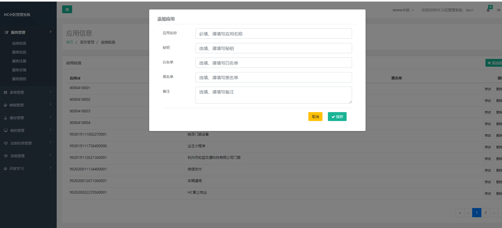
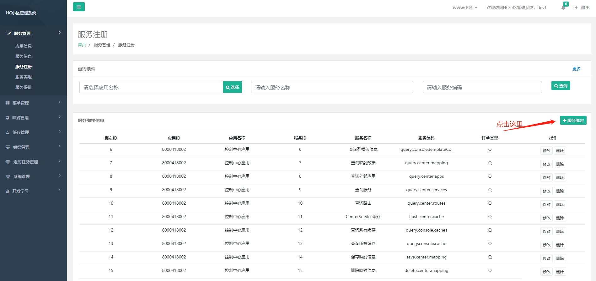
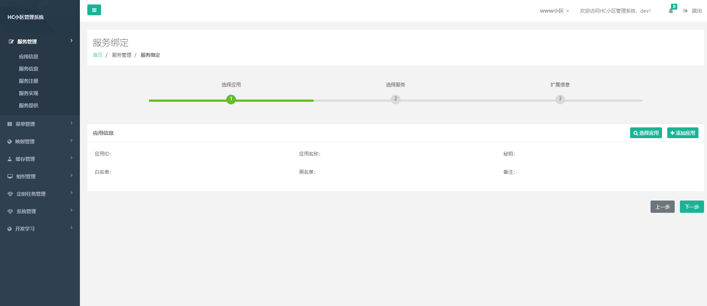
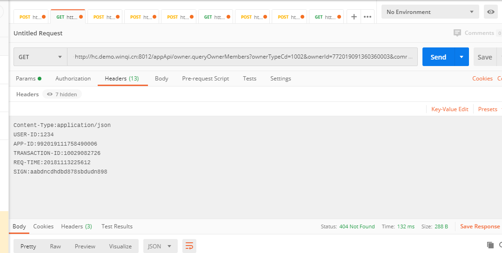

## 2.2.1 如何获取应用

#### 1、登录开发者平台
登录HC小区管理系统开发者账户dev(密码请在u_user中自己修改)

#### 2、添加应用
在服务管理> 应用信息 中添加应用 如下图


应用名称请填写实际调用方名称，如果要开启鉴权方式调用，请填写秘钥，秘钥建议用uuid生成随机字母，如果不鉴权为空，
白名单和黑名单为调用方出口主机IP限制调用IP

## 2.2.2 如何接口绑定

#### 应用绑定接口

在服务注册>服务注册 中点击服务绑定，给新建应用绑定已有接口，系统拥有接口可以在 服务管理> 服务信息中查看



## 2.2.3 如何调用接口

#### 调用地址拼接

接口地址拼接方式为 https://您的IP:您的端口(service-front的端口8012)/app/服务编码  或者为
https://您的IP:您的端口(service-api的端口8008)/api/服务编码

第一个地址为只有在登录获取token后才能调用，第二个地址不需要获取token直接调用，service-front 的作用为校验 调用方是否登录


#### 调用固定传参介绍

接口调用基本需要传一下4个参数到http header

|参数名称|约束|类型|长度|描述|取值说明|
| :-: | :-: | :-: | :-: | :-: | :-:|
|app-id|1|String|30|应用ID|通过添加应用生成|
|transaction-id|1|String|30|请求流水号|建议为uuid|
|sign|1|String|-|签名|请参考签名说明|
|req-time|1|String|-|请求时间|YYYYMMDDhhmmss|


#### 举例


###### 举例
> 地址：[http://api.java110.com:8008/api/owner.queryOwnerMembers?memberId=772019091360360003&communityId=7020181217000001](http://api.java110.com:8008/api/owner.queryOwnerMembers?memberId=772019091360360003&communityId=7020181217000001)

``` javascript
请求头信息：
Content-Type:application/json
USER-ID:1234
APP-ID:8000418002
TRANSACTION-ID:10029082726
REQ-TIME:20181113225612
SIGN:aabdncdhdbd878sbdudn898
请求报文：

无

返回报文：
{
	"machines": [{
		"age": "1",
		"machineId": "123",
		"machineCode": "Acc009",
		"machineVersion": "v1.0",
		"machineName": "门禁大门位置测试",
		"locationTypeCd": "1000",
		"locationObjName": "东大门",
		"locationObjId": "7020181217000001"
	}],
	"page": 0,
	"records": 1,
	"rows": 0,
	"total": 1
}

```



## 2.2.4 接口签名

签名参考以下代码

```java

    /**
     * 生成签名
     *
     * @param transactionId
     * @return
     */
    public static String generatorSign(String transactionId, String requestTime, String param) throws NoAuthorityException {

        if ("ON".equals(MappingCacheFactory.getValue("SIGN_FLAG"))) {
            String reqInfo = transactionId + requestTime + MappingCacheFactory.getValue("APP_ID") + param + MappingCacheFactory.getValue("SECURITY_CODE");
            return md5(reqInfo);
        }
        return "";
    }

```

get 调用方式签名

```

 //get 方式请求 url 为get请求时的地址 SystemConstant.HTTP_TRANSACTION_ID 为 header 中 TRANSACTION-ID SystemConstant.HTTP_REQ_TIME
    //为header 中 REQ-TIME
    String tempGetParam = "";
    if (url.indexOf("?") > 0) {
        tempGetParam = url.substring(url.indexOf("?"));
    }
    String paramIn = tempGetParam ;
    // 生成sign
    String sign = generatorSign(httpHeaders.get(SystemConstant.HTTP_TRANSACTION_ID).get(0),
            httpHeaders.get(SystemConstant.HTTP_REQ_TIME).get(0),
            paramIn);

```

post 调用方式签名

```

    //post 方式请求 param 为post body内容SystemConstant.HTTP_TRANSACTION_ID 为 header 中 TRANSACTION-ID SystemConstant.HTTP_REQ_TIME
    //为header 中 REQ-TIME
    String tempGetParam = "";
    String paramIn = param;
    // 生成sign
    String sign = generatorSign(httpHeaders.get(SystemConstant.HTTP_TRANSACTION_ID).get(0),
            httpHeaders.get(SystemConstant.HTTP_REQ_TIME).get(0),
            paramIn);

```


