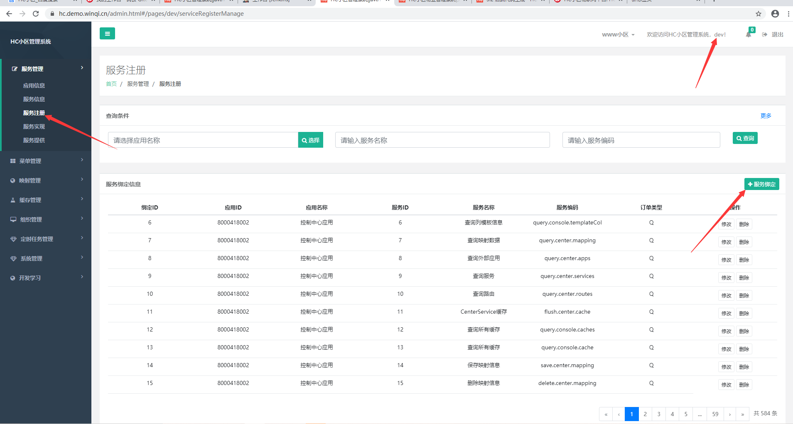
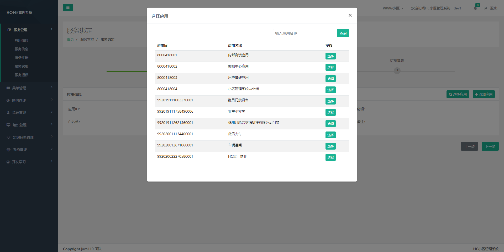
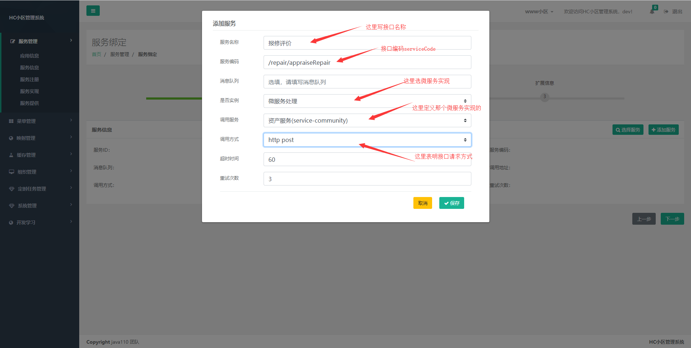

## 说明


## 创建表

HC小区管理系统没有对表结构太多的要求，但是我们官方建议 表中 至少包含 create_time 创建时间，status_cd 数据是否失效状态
如果需要数据状态时统一使用 state 字段来说明，表中字段如果有多种值时 建议在t_dict 表中记录 方便查询理解
如果数据需要分片时请定义分片字段，如下小区ID作为分片字段

```aidl
   create_time timestamp NOT NULL DEFAULT CURRENT_TIMESTAMP COMMENT '创建时间',
  `status_cd` varchar(2) COLLATE utf8_bin NOT NULL COMMENT '数据状态，详细参考t_dict表，0, 在用 1失效',
   `community_id` varchar(30) NOT NULL COMMENT '小区ID',
   `state` varchar(4) NOT NULL COMMENT '报修状态，请查看t_dict 表',
```

样例如下(报修表结构)：

```aidl
CREATE TABLE `r_repair_pool` (
  `repair_id` varchar(30) NOT NULL COMMENT '报修ID',
  `community_id` varchar(30) NOT NULL COMMENT '小区ID',
  `repair_type` varchar(30) NOT NULL COMMENT '报修类型',
  `repair_name` varchar(12) NOT NULL COMMENT '报修人姓名',
  `tel` varchar(11) NOT NULL COMMENT '手机号',
  `context` longtext NOT NULL COMMENT '报修内容',
  `create_time` timestamp NOT NULL DEFAULT CURRENT_TIMESTAMP COMMENT '创建时间',
  `state` varchar(4) NOT NULL COMMENT '报修状态，请查看state 表',
  `status_cd` varchar(2) NOT NULL DEFAULT '0' COMMENT '数据状态，详细参考c_status表，S 保存，0, 在用 1失效',
  `repair_obj_type` varchar(12) NOT NULL COMMENT '报修对象类型 001 小区 002 楼栋 003 单元 004 房屋',
  `repair_obj_id` varchar(30) NOT NULL COMMENT '报修对象ID',
  `repair_obj_name` varchar(30) NOT NULL COMMENT '报修对象名称',
  `appointment_time` timestamp NOT NULL DEFAULT CURRENT_TIMESTAMP COMMENT '预约时间',
  UNIQUE KEY `repair_id` (`repair_id`) USING BTREE
)
```

## 接口定位

1、在接口开发前先定位该接口属于 哪一个微服务范畴，比如报修功能，官方定位为资产服务范畴（service-community）
现在我们以报修评价功能为例说明如何开发

## 对外开放地址

192.168.1.16:8008/api/repair/appraiseRepair

post 方式

## 接口要求

该接口要求为在 报修评价时 向评价表（官方定位为service-common服务中开发）中插入一条记录，并且将报修工单状态改为
待回访状态，将工单处理人表中状态改为处理完成

## 如何开发

#### service-common 服务开发评价接口

在service-common\src\main\java\com\java110\common\api 下加入AppraiseApi类 为评价统一入口类并且实现
IAppraiseApi接口（定义该接口的目的是为了其他服务通过feign调用）


IAppraiseApi接口

```java

import com.java110.config.feign.FeignConfiguration;
import com.java110.dto.appraise.AppraiseDto;
import org.springframework.cloud.openfeign.FeignClient;
import org.springframework.web.bind.annotation.RequestBody;
import org.springframework.web.bind.annotation.RequestMapping;
import org.springframework.web.bind.annotation.RequestMethod;

@FeignClient(name = "common-service", configuration = {FeignConfiguration.class})
@RequestMapping("/appraise")
public interface IAppraiseApi {

    /**
     * 保存接口评价
     * @param appraiseDto
     * @return
     */
    @RequestMapping(value = "/saveAppraise", method = RequestMethod.POST)
    public AppraiseDto saveAppraise(@RequestBody AppraiseDto appraiseDto);
}
```

```java
@FeignClient(name = "common-service", configuration = {FeignConfiguration.class});
@RequestMapping("/appraise")
```
表明是那个微服务提供的服务，我们的接口类统一放到java110-interface\src\main\java\com\java110\intf\
下 请求地址部分

```java
    @RequestMapping(value = "/saveAppraise", method = RequestMethod.POST)
    public AppraiseDto saveAppraise(@RequestBody AppraiseDto appraiseDto)
```

该部分为接口方法的定义，表明方法请求方式 get 还是post 以及入参定义

AppraiseApi入口类

```java
import com.java110.common.service.appraise.ISaveAppraiseService;
import com.java110.dto.appraise.AppraiseDto;
import com.java110.intf.common.appraise.IAppraiseApi;
import com.java110.intf.community.repair.IRepairApi;
import org.springframework.beans.factory.annotation.Autowired;
import org.springframework.web.bind.annotation.RequestBody;
import org.springframework.web.bind.annotation.RestController;

@RestController
public class AppraiseApi implements IAppraiseApi {
    @Autowired
    private ISaveAppraiseService saveAppraiseServiceImpl;

    @Override
    public AppraiseDto saveAppraise(@RequestBody AppraiseDto appraiseDto) {
        return saveAppraiseServiceImpl.saveAppraise(appraiseDto);
    }
}

```

该类为对外提供评价接口功能，我们建议 在api 只是做接口的定义和必要的入参数据校验，具体业务有下面的Service类实现
如SaveAppraiseServiceImpl.java 类

```java


@Service("saveAppraiseServiceImpl")
public class SaveAppraiseServiceImpl implements ISaveAppraiseService {

    @Autowired
    IAppraiseServiceDao appraiseServiceDaoImpl;

    @Override
    @Java110Transactional
    public AppraiseDto saveAppraise(AppraiseDto appraiseDto) {

        if (StringUtil.isEmpty(appraiseDto.getAppraiseId())|| appraiseDto.getAppraiseId().startsWith("-")) {
            appraiseDto.setAppraiseId(GenerateCodeFactory.getGeneratorId(GenerateCodeFactory.CODE_PREFIX_appraiseId));
        }

        if (StringUtil.isEmpty(appraiseDto.getParentAppraiseId())) {
            appraiseDto.setParentAppraiseId("-1");
        }
        //添加 评价功能
        int saveFlag = appraiseServiceDaoImpl.saveAppraise(BeanConvertUtil.beanCovertMap(appraiseDto));
        if (saveFlag > 0) {
            return appraiseDto;
        }
        return null;
    }
}
```

这里需要注意的是@Java110Transactional注解，主要是为了保证事务一致性


#### service-community 服务报修评价接口


在service-community\src\main\java\com\java110\common\api 下加入RepairApi类 为评价统一入口类并且实现
IRepairApi接口（定义该接口的目的是为了其他服务通过feign调用）


IRepairApi接口

```java

@FeignClient(name = "community-service", configuration = {FeignConfiguration.class})
@RequestMapping("/repair")
public interface IRepairApi {
    /**
     * 报修评价
     * @param appraiseDto
     * @return
     */
    @RequestMapping(value = "/appraiseRepair", method = RequestMethod.POST)
    public AppraiseDto appraiseRepair(@RequestBody AppraiseDto appraiseDto);
}
```


RepairApi入口类

```java
/**
 * 报修 控制类
 */
@RestController
public class RepairApi implements IRepairApi {
    @Autowired
    private IAppraiseRepairService appraiseRepairServiceImpl;

    /**
     * 对外 报修评价
     * @param appraiseDto
     * @return
     */
    @Override
    public AppraiseDto appraiseRepair(@RequestBody AppraiseDto appraiseDto) {
        return appraiseRepairServiceImpl.appraiseRepair(appraiseDto);
    }
}

```

该类为对外提供评价接口功能，我们建议 在api 只是做接口的定义和必要的入参数据校验，具体业务有下面的Service类实现
如AppraiseRepairServiceImpl.java 类

```java

@Service("appraiseRepairServiceImpl")
public class AppraiseRepairServiceImpl implements IAppraiseRepairService {

    @Autowired
    private IAppraiseApi appraiseApi;
    @Autowired
    private IRepairServiceDao repairServiceDaoImpl;

    @Autowired
    private IRepairUserServiceDao repairUserServiceDaoImpl;

    @Override
    @Java110Transactional
    public AppraiseDto appraiseRepair(@RequestBody AppraiseDto appraiseDto) {


        Map info = new HashMap();
        info.put("repairId", appraiseDto.getObjId());
        info.put("staffId", appraiseDto.getAppraiseUserId());
        info.put("state", RepairUserDto.STATE_DOING);
        info.put("endTime", DateUtil.getNow(DateUtil.DATE_FORMATE_STRING_A));
        info.put("context", "评价完成");
        info.put("statusCd","0");
        repairUserServiceDaoImpl.updateRepairUserInfoInstance(info);
        //将工单表的状态修改为完成
        info = new HashMap();
        info.put("repairId", appraiseDto.getObjId());
        info.put("statusCd", "0");
        info.put("state", RepairDto.STATE_RETURN_VISIT);
        repairServiceDaoImpl.updateRepairInfoInstance(info);


        //评价表中加入评价内容
        appraiseDto.setParentAppraiseId("-1");
        appraiseDto.setObjType(AppraiseDto.OBJ_TYPE_REPAIR);
        appraiseDto.setAppraiseType(AppraiseDto.APPRAISE_TYPE_PUBLIC);
        return appraiseApi.saveAppraise(appraiseDto);

    }
}
```

appraiseApi.saveAppraise(appraiseDto) 这个就是去调用了评价服务，appraiseRepair 方法用@Java110Transactional
标记 表明在一个事务中 评价服务的失败时会回退前两步

```java
        repairUserServiceDaoImpl.updateRepairUserInfoInstance(info);
        repairServiceDaoImpl.updateRepairInfoInstance(info);
```
修改报修人员状态和 报修工单状态

后面的dao层和sql语句请自行查看代码

## 接口注册

接口注册是通过开发这账户注册，登录开发者账户dev/密码自行修改，打开服务管理--> 服务注册页面，点击服务绑定，如下图







## 接口刷新缓存

在 开发这账户下 缓存管理 --> 刷新缓存 点击刷新全部缓存 或者 业务配置缓存 