## 开发环境安装教程

#### 安装maven

这里略过,请自行百度，maven的settings.xml 中的中央仓库地址建议修改为国内仓库地址，如阿里云的，这样有利于项目编译和打包速度

```
<mirrors>
        <mirror>
              <id>alimaven</id>
              <name>aliyun maven</name>
              <url>http://maven.aliyun.com/nexus/content/groups/public/</url>
              <mirrorOf>central</mirrorOf>
        </mirror>

</mirrors>
```

#### 安装git

这里略过,请自行百度

#### 安装 idea 开发工具

社区版和收费版都可以, 百度自行下载安装

#### 下载代码

选择项目保存文件夹如 C:\Users\Administrator\Documents\project\hc 目录下，执行

```
   git clone https://github.com/java110/MicroCommunity.git

```

或者 备份版本代码，主要是下载速度比较快

 ```
   git clone https://gitee.com/wuxw7/MicroCommunity.git

 ```

#### 编译代码

进入MicroCommunity目录下执行命令

```
    mvn clean install

```

和

```
    mvn clean package

```

#### idea 打开代码

用maven的方式打开项目，在idea的设置中修改第一步安装的maven地址和settings.xml地址，点击OK，然后在idea的右上侧点击Maven选项，
点击Reimport All Maven Projects,重新导入maven依赖jar包

#### 安装mysql

推荐安装 5.6 版本mysql ，安装过程请自行百度，将 docs\db文件下的 TT 和 hc_community 文件导入到mysql中，有可能这个sql不是最新的，
你也可以加入群827669685(已满)，799748606（群二），群文件获取最新的sql文件

#### 安装kafka

请自行百度安装

#### 安装 zookeeper

请自行百度安装

#### 安装Redis

请自行百度安装

#### 修改hosts

kafka zookeeper Redis mysql 开源中间件 则将对应域名改为对应IP

```
这里写mysql的IP dev.db.java110.com
这里写zookeeper的IP dev.zk.java110.com
这里写kafka的IP dev.kafka.java110.com
这里写redis的IP dev.redis.java110.com
127.0.0.1 api.java110.com
127.0.0.1 dev.java110.com

```

#### 启动相应服务

需要启动的服务有 service-eureka、service-api、service-order、service-community、
service-store、service-user、service-front、service-fee、service-common和service-job

找到服务下 src目录下 main/java/com/java110/您的服务名/XXApplicationStart.java 类打开 点击运行main方法就可以启动

注意：由于service-order 启动需要刷缓存所以比起其他服务 需要传 -Dcache 参数才可以，
具体参考地址 https://blog.csdn.net/u013713294/article/details/53020293


## 生产环境安装教程

> yum install -y wget && wget https://dl.winqi.cn/hc/hcInstall.sh && sh hcInstall.sh 您的私网IP

您的私网IP 可以通过 ifconfig 命名查看 如果是云主机可以在后台查看


## 网友抒写安装部署（前后端分离）

### 一、	部署说明

1、	软硬件配置

硬件：云服务器最低配置4核16G

软件：需要安装 mysql + kafka + zookeeper + redis，docker可选

开源代码说明：

HC小区后端代码

https://gitee.com/wuxw7/MicroCommunity

HC小区前段代码

https://gitee.com/java110/MicrCommunityWeb

HC智慧家庭（业主版）

https://gitee.com/java110/WechatOwnerService

HC掌上物业（物业版）

https://gitee.com/java110/PropertyApp

分支说明（branch）：

分支管理说明，master 为前后端未分离代码，back 为前后端分离后端代码


2、	新建账号

添加hc、 mysql、 redis、 zk 、kafka 用户

    # 应用账户，安装docker，运行jar包
    sudo adduser hc

    # 数据库
    sudo adduser mysql

    sudo adduser redis
    sudo adduser zk
    sudo adduser kafka

修改密码

    passwd hc

密码应符合大小写英文字母+特殊符号+数字，最短8位较好

    Changing password for user hc.
    New password:

如 Yao@5937。

3、接下来赋予sudo权限，输入命令

    sudo visudo

此命令意思是vim /etc/sudoers，但是会有sudo的校验，所以推荐上面的用法。

在文件中，找到下面这段，在root下添加上面添加的5个用户

    ## Allow root to run any commands anywhere
    root    ALL=(ALL)       ALL

添加完后，如下

    ## Allow root to run any commands anywhere
    root    ALL=(ALL)       ALL
    hc      ALL=(ALL)       ALL
    mysql   ALL=(ALL)       ALL
    redis   ALL=(ALL)       ALL
    zk      ALL=(ALL)       ALL
    kafka   ALL=(ALL)       ALL

:wq 保存退出。

### 二、	安装docker

1、切换hc用户，登录服务器

2、安装docker

    sudo yum install docker -y

查看docker版本

    docker version

> 疑问：
>
> 看docker的安装文章都是用yum install docker-ce 安装的，是因为ce是免费版。
但是当前时间2020/03/19，这个命令已经无法安装。
>
> 那用 yum install docker -y 命令是安装的 CE 还是 EE 版本？

我的版本

    [root@hostone /]# docker version
    Client:
     Version:         1.13.1
     API version:     1.26
     Package version:
    Cannot connect to the Docker daemon at unix:///var/run/docker.sock. Is the docker daemon running?

有句奇怪的话，问你docker咋没运行?别急，启动下

    sudo systemctl start docker  #启动docker
    sudo systemctl enable docker #开机启动docker
    sudo systemctl status docker #查看docker状态

再用docker version 看下

    [root@hostone /]# docker version
    Client:
     Version:         1.13.1
     API version:     1.26
     Package version: docker-1.13.1-109.gitcccb291.el7.centos.x86_64
     Go version:      go1.10.3
     Git commit:      cccb291/1.13.1
     Built:           Tue Mar  3 17:21:24 2020
     OS/Arch:         linux/amd64

    Server:
     Version:         1.13.1
     API version:     1.26 (minimum version 1.12)
     Package version: docker-1.13.1-109.gitcccb291.el7.centos.x86_64
     Go version:      go1.10.3
     Git commit:      cccb291/1.13.1
     Built:           Tue Mar  3 17:21:24 2020
     OS/Arch:         linux/amd64
     Experimental:    false

ok，很简单地安装完成了。


最后，创建docker用户组，赋权给hc用户

    sudo groupadd docker

    sudo usermod -aG docker hc

切换到hc账户，查看docker状态

    sudo docker ps

然后需要安装一个docker-comose，来启动，停止和重启应用

    sudo yum install docker-compose


docker启动、停止命令

    # 启动
    sudo systemctl start docker

    # 守护进程重启
    sudo systemctl daemon-reload

    # 重启docker服务
    sudo systemctl restart docker

    # 重启docker服务
    sudo service docker restart

    # 关闭docker
    sudo systemctl stop docker


### 三、安装mysql

1、新开个mysql连接窗口，切换到mysql 用户。

 2、下载安装mysql


    # 下载5.7 安装包
    wget http://dev.mysql.com/get/mysql57-community-release-el7-8.noarch.rpm

    # 配置安装依赖
    sudo yum localinstall -y mysql57-community-release-el7-8.noarch.rpm

    # 安装数据库
    sudo yum install -y mysql-community-server

    # 数据库启动
    sudo systemctl start mysqld

    # 查看数据库状态
    systemctl status mysqld

    # 数据库启动
    sudo systemctl enable mysqld

3、安装启动完成，查看密码

    # 密码在mysql日志中
    grep 'pass' /var/log/mysqld.log

    [mysql@iZ2zebthf35ejlps5v87ksZ ~]$ grep 'pass' /var/log/mysqld.log
    2020-03-14T12:28:57.051218Z 1 [Note] A temporary password is generated for root@localhost: <z?Shbek>8Gd

<z?Shbek>8Gd 就是我的初始密码了。

4、连接mysql

    # 连接mysql， 默认端口3306
    mysql -u root -p

输入密码<z?Shbek>8Gd，进入mysql命令行，修改root密码

    SET PASSWORD = PASSWORD('Db@369012');

    mysql> SET PASSWORD = PASSWORD('Db@369012');
    Query OK, 0 rows affected, 1 warning (0.00 sec)

5、创建hc用户，赋权

    create user 'TT'@'%' identified by 'TT@HCvvMM33';
    create user 'hc_community'@'%' identified by 'hc_community@HCvvMM33';
    flush privileges;
    CREATE DATABASE `TT` ;
    grant all privileges on `TT`.* to 'TT'@'%' ;
    CREATE DATABASE `hc_community` ;
    grant all privileges on `hc_community`.* to 'hc_community'@'%' ;
    flush privileges;

6、启动配置

如果是5.7版本的mysql，导入时可能报错，需要修改my.cnf

    sudo vim /etc/my.cnf

修改内容如下，在[mysqld]下添加

    # 导入大SQL文件
    max_allowed_packet=900M

    # 解决5.6的SQL在5.7的执行错误 ERROR 1067 (42000) Invalid default value for 'end_time'
    sql_mode = ONLY_FULL_GROUP_BY,STRICT_TRANS_TABLES,NO_ZERO_IN_DATE,ERROR_FOR_DIVISION_BY_ZERO,NO_AUTO_CREATE_USER,NO_ENGINE_SUBSTITUTION


修改完后，重启mysql

    sudo systemctl restart mysqld

    systemctl status mysqld

7、导入最新的sql文件

连接TT用户，导入前后端分离版的SQL，文件名

> 分离版2020.3.18.sql

连接hc_community,导入SQL文件

> hc_community20200220.sql


四、安装java

1、切回hc用户登陆服务器

    su - hc

2、上传java至/home/hc

    # 创建java文件夹
    sudo mkdir –p /usr/local/java

    # 解压至/usr/local/java
    sudo tar zxvf jdk-8u131-linux-x64.tar.gz -C /usr/local/java

3、配置java环境

打开系统配置文件

    sudo vim /etc/profile

在文件最后添加内容如下：

    export JAVA_HOME=/usr/local/java/jdk1.8.0_131
    export JRE_HOME=$JAVA_HOME/jre
    export CLASSPATH=.:$JAVA_HOME/lib:$JRE_HOME/lib:$CLASSPATH
    export PATH=$JAVA_HOME/bin:$JRE_HOME/bin:$PATH

记得刷新变量环境

    # 刷新变量环境
    source /etc/profile

查看是否生效

    [hc@iZ2zebthf35ejlps5v87ksZ java]$ echo $JAVA_HOME
    /usr/local/java/jdk1.8.0_131

五、安装redis

1、切换为redis用户，上传源码包至/home/redis

    # 查看当前路径
    [redis@iZ2zebthf35ejlps5v87ksZ ~]$ pwd
    /home/redis

    # 查看当前路径下文件
    [redis@iZ2zebthf35ejlps5v87ksZ ~]$ ll
    total 1684
    -rw-rw-r-- 1 redis redis 1723533 Mar 14 21:03 redis-4.0.6.tar.gz

2、解压

    tar zxvf redis-4.0.6.tar.gz

文件解压后，有个文件夹redis-4.0.6，如下：

    [redis@iZ2zebthf35ejlps5v87ksZ ~]$ ll
    total 1688
    drwxrwxr-x 6 redis redis    4096 Dec  5  2017 redis-4.0.6
    -rw-rw-r-- 1 redis redis 1723533 Mar 14 21:03 redis-4.0.6.tar.gz


3、编译安装

    cd redis-4.0.6

    sudo make prefix=/home/redis/redis-4.0.6 install

如果不用sudo，安装失败，信息如下

    Hint: It's a good idea to run 'make test' ;)

    INSTALL install
    install: cannot create regular file ‘/usr/local/bin/redis-server’: Permission denied
    make[1]: *** [install] Error 1
    make[1]: Leaving directory `/home/redis/redis-4.0.6/src'
    make: *** [install] Error 2

成功安装

    make[1]: Entering directory `/home/redis/redis-4.0.6/src'
    CC Makefile.dep
    make[1]: Leaving directory `/home/redis/redis-4.0.6/src'
    make[1]: Entering directory `/home/redis/redis-4.0.6/src'

    Hint: It's a good idea to run 'make test' ;)

        INSTALL install
        INSTALL install
        INSTALL install
        INSTALL install
        INSTALL install
    make[1]: Leaving directory `/home/redis/redis-4.0.6/src'

4、redis配置修改

备份reids.conf

    cp redis.conf redis.conf_hc

    # 修改redis配置
    vim redis.conf

修改内容如下

    # 任何机器都可以访问，生产环境需改成特点ip访问
    bind 0.0.0.0

    # 密码
    requirepass hc8866

    # 守护进程
    daemonize yes

:wq 保存退出。

5、启动redis

    ./src/redis-server ./redis.conf

启动信息如下

    [redis@iZ2zebthf35ejlps5v87ksZ redis-4.0.6]$ ./src/redis-server ./redis.conf
    9490:C 14 Mar 22:45:12.384 # oO0OoO0OoO0Oo Redis is starting oO0OoO0OoO0Oo
    9490:C 14 Mar 22:45:12.384 # Redis version=4.0.6, bits=64, commit=00000000, modified=0, pid=9490, just started
    9490:C 14 Mar 22:45:12.384 # Configuration loaded

6、客户端连接redis

    ./src/redis-cli -p 6379 -a hc8866

连接成功内容如下

    [redis@izbp117mtgmllet9ryobawz redis-4.0.6]$ ./src/redis-cli -p 6379 -a hc8866
    127.0.0.1:6379> keys *
    (empty list or set)
    127.0.0.1:6379>

推荐使用rdm等客户端工具查看redis数据。

六、安装zookeeper

1、切换为zk用户，上传源码包至/home/zk

2、解压

    tar zxvf zookeeper-3.4.6.tar.gz

3、进入zk目录

     cd zookeeper-3.4.6

4、准备启动conf

    cp ./conf/zoo_sample.cfg ./conf/zoo.cfg

5、启动zk

    ./bin/zkServer.sh start

启动信息如下

    [zk@iZ2zebthf35ejlps5v87ksZ zookeeper-3.4.6]$ ./bin/zkServer.sh start
    JMX enabled by default
    Using config: /home/zk/zookeeper-3.4.6/bin/../conf/zoo.cfg
    Starting zookeeper ... STARTED

七、部署项目

1、切回应用账户hc，安装git

    sudo yum install git -y

2、安装maven

    sudo yum install maven -y

3、修改maven源为阿里源

    sudo vim /usr/share/maven/conf/settings.xml

在mirrors标签下添加如下内容

    <mirror>
          <id>alimaven</id>
          <name>aliyun maven</name>
          <url>http://maven.aliyun.com/nexus/content/groups/public/</url>
          <mirrorOf>central</mirrorOf>
     </mirror>

4、下载代码

    mkdir hcProject

    cd hcProject

    git clone https://gitee.com/wuxw7/MicroCommunity.git

5、编译代码

    cd /home/hc/hcProject/MicroCommunity

    mvn clean install

6、修改redis配置

打开hcConf项目下所有 application-dev.yml，修改redis账号密码

端口没有修改则不用更换

7、替换ip

打开所有docker-compose.yml，如hcConf\Api\docker\docker-compose.yml

> 这里推荐在windows下用nodePad++的文件查找替换功能，在目录下批量替换

> 如果喜欢在Linux修改的话，可以用sed 批量替换

将如下内容中的ip替换为对应的服务器ip

       extra_hosts:
       - "dev.java110.com:192.168.100.29"
       - "dev.db.java110.com:192.168.100.29"
       - "dev.zk.java110.com:192.168.100.29"
       - "dev.kafka.java110.com:192.168.100.29"
       - "dev.redis.java110.com:192.168.100.29"
       - "api.java110.com:192.168.100.29"

8、上传bin 和 hcConf 至目录/home/hc/hcProject 下


八、后端docker服务启动

1、下载修改后的yaoHcConf文件，解压后得到bin、hcConf目录，上传至hcProject

2、启动reset_all.sh

相比群里的原文件，增加了FrontService与eureka的服务。

> 吴老大说没必要每次都重启eureka服务，想想对于初次接触HC项目的小白们（比如我）来说，还是比价有难度的，所以把eureka加进去了，省事。

    cd /home/hc/hcProject/bin

    chmod +x *.sh

    sudo ./reset_all.sh

3、docker 常用命令

启动后查看服务是否启动成功

    # 查看所有正在运行容器
    sudo docker ps

    # containerId 是容器的ID
    sudo docker stop containerId

     # 查看所有容器
    sudo docker ps -a

    # 查看所有容器ID
    sudo docker ps -a -q

    # stop停止所有容器
    sudo docker stop $(sudo docker ps -a -q)
    sudo docker stop $(sudo docker ps -aq)

    # remove删除所有容器
    sudo docker  rm $(sudo docker ps -a -q)

    # 删除所有镜像
    sudo docker rmi $(sudo docker images -q)

    # 进入某个容器查看
    sudo docker exec -i -t [containerId] /bin/bash
    # 示例
    sudo docker exec -it [76ae97d878eb] /bin/bash


4、异常处理

* 1） network 异常

异常：

> ERROR: Network java110-net declared as external, but could not be found. Please create the network manually using `docker network create java110-net` and try again.

解决方法：

    docker network create java110-net

* 2）特殊字符问题

docker中容器未启动成功

    CONTAINER ID        IMAGE                             COMMAND                  CREATED             STATUS                         PORTS                    NAMES
    6632de00214f        docker_frontserivce               "/root/start_front..."   30 minutes ago      Restarting (1) 2 minutes ago                            frontserivce-1

使用docker logs 查看日志

    sudo docker logs -f --tail=100 76ae97d878eb

报错如下

    standard_init_linux.go:178: exec user process caused "no such file or directory"

先停止了这个服务，然后去服务下（/home/hc/hcProject/app/FrontService）看看是什么问题，怀疑是启动脚本问题

    sudo docker-compose -f /home/hc/hcProject/app/FrontService/docker/docker-compose.yml       down;

发现是frontserivce的docker下的onStart.sh、start_front.sh脚本中出现了^M字符,使用dos2unix工具转换下。

    cd /home/hc/hcProject/app/FrontService/docker

    sudo yum install dos2unix

    sudo dos2unix onStart.sh

    sudo dos2unix ./bin/start_front.sh

启动这个服务

    sudo docker-compose -f /home/hc/hcProject/app/FrontService/docker/docker-compose.yml       up -d --build --force-recreate;

如果没有down掉服务，也可使用重启命令

    sudo docker-compose -f /home/hc/hcProject/app/FrontService/docker/docker-compose.yml       restart;

在使用restart的脚本重启后发现又出现报错了，突然想到是源头脚本出了问题，restart的脚本又copy了一次hcConf下文件。

看了下果然如此，重新去除下特殊字符^M

    vi -b /home/hc/hcProject/hcConf/FrontService/docker/onStart.sh

    sudo dos2unix /home/hc/hcProject/hcConf/FrontService/docker/*.sh

    cd /home/hc/hcProject/bin

    sudo ./restart_all.sh


* 3） yml 格式问题

启动之后又发现问题

    2020-03-19 18:29:24.945 ERROR 8 --- [           main] o.s.boot.SpringApplication               : Application run failed
    java.lang.IllegalStateException: Failed to load property source from location 'classpath:/application-dev.yml'
    ……
    could not find expected ':' in 'reader', line 15, column 1:
    eureka:    ^
	at org.yaml.snakeyaml.scanner.ScannerImpl.stalePossibleSimpleKeys(ScannerImpl.java:466)

明显提示第15行的yml文件报错，查看了下，报错原文如下

    password:hc8866

是因为password第冒号后没有空一格输入密码。

* 4） hosts问题

命运多舛，又出了问题

    DiscoveryClient_FRONT-SERVICE/172.19.0.3:8012: registering service...

这次的问题是因为docker-compose.yml, 因为新版的前后端分离版本升级第关系，群文件的hcConf里没有FrontService，我从MicroCommunity拷贝了一个过去，但是没有启用extra_hosts，还是用第net_works导致。原文件片段如下：

    version: '2'
    services:
       frontserivce:
           container_name: frontserivce-1
           build:
              context: .
              dockerfile: Dockerfile
           restart: always
           ports:
           - "8020:8020"
           volumes:
           - ../target/FrontService.jar:/root/target/FrontService.jar
           networks:
           - java110-net
    #       mem_limit: 1024m
    #       extra_hosts:
    #       - "dev.java110.com:192.168.1.18"
    #       - "dev.db.java110.com:192.168.1.18"
    #       - "dev.zk.java110.com:192.168.1.18"
    #       - "dev.kafka.java110.com:192.168.1.18"
    #       - "dev.redis.java110.com:192.168.1.18"
    #       - "api.java110.com:92.168.1.18"
    networks:
      java110-net:
        external: true

修改后如下

    version: '2'
    services:
       frontserivce:
           container_name: frontserivce-1
           build:
              context: .
              dockerfile: Dockerfile
           restart: always
           ports:
           - "8020:8020"
           volumes:
           - ../target/FrontService.jar:/root/target/FrontService.jar

           mem_limit: 1536m
           extra_hosts:
           - "dev.java110.com:47.96.141.41"
           - "dev.db.java110.com:47.96.141.41"
           - "dev.zk.java110.com:47.96.141.41"
           - "dev.kafka.java110.com:47.96.141.41"
           - "dev.redis.java110.com:47.96.141.41"
           - "api.java110.com:47.96.141.41"

47.96.141.41为docker服务器宿主机地址。

* 5） docker启动脚本问题

发现docker的8012端口启动了，但是其实真正的服务没有启动，log也没有报错，停留在

    2020-03-20 14:22:55.501  INFO 1317 --- [ost-startStop-1] c.netflix.config.DynamicPropertyFactory  : DynamicPropertyFactory is initialized with configuration sources: com.netflix.config.ConcurrentCompositeConfiguration@616da524

进入docker内部的bash看看

    sudo docker exec -it frontserivce-1 /bin/bash

进入bash后，查看进程

    ps -aux

发现并没有java -jar进程，在docker容器内手动启动下试试

    java -jar -Dspring.profiles.active=dev -Xms512m -Xmx1024m target/FrontService.jar

竟然启动起来了，启动后内容如下

    root@9018e70e1220:~# ps -aux
    USER       PID %CPU %MEM    VSZ   RSS TTY      STAT START   TIME COMMAND
    root         1  0.0  0.0  21108  1508 ?        Ss   14:28   0:00 /bin/bash /root/start_front.sh dev
    root         8  0.0  0.0   7456   632 ?        S    14:28   0:00 tail -100f front.log
    root        38  0.0  0.0  21324  2148 ?        Ss   14:36   0:00 /bin/bash
    root        66  9.4  4.5 4757012 733244 ?      Sl+  14:41   1:14 java -jar -Dspring.profiles.active=dev -Xms512m -Xmx1024m target/FrontService.jar


估计还是启动脚本有问题，需要回头排查下。

八、前端服务部署

1、down下来前端项目

    git clone  https://gitee.com/java110/MicrCommunityWeb.git

2、安装nodeJs环境

3、打开项目，修改app.js

    app.use('/callComponent',proxy('http://后端服务ip:8012',opts));

修改ip端口为FrontService的服务端口

4、启动

与app.js统计目录下，输入命令编译启动

    npm install

    npm start

打开ip:3000端口，查看前端页面

端口可以修改，在项目的 bin/www 文件中

    var port = normalizePort(process.env.PORT || '3000');


## 简单才是美网友贡献安装

#### 1. 安装 Java

```
# cd /opt
# wget https://mirrors.huaweicloud.com/java/jdk/8u202-b08/jdk-8u202-linux-x64.tar.gz
# tar zxfv jdk-8u202-linux-x64.tar.gz
# mkdir –p /usr/local/java
# mv /opt/jdk1.8.0_202 /usr/local/java/1.8.0_202
# vim /etc/profile

export JAVA_HOME=/usr/local/java/1.8.0_202
export JRE_HOME=$JAVA_HOME/jre
export CLASSPATH=.:$JAVA_HOME/lib:$JRE_HOME/lib:$CLASSPATH
export PATH=$JAVA_HOME/bin:$JRE_HOME/bin:$PATH

# source /etc/profile
# java -version
java version "1.8.0_202"
Java(TM) SE Runtime Environment (build 1.8.0_202-b08)
Java HotSpot(TM) 64-Bit Server VM (build 25.202-b08, mixed mode)
```

#### 2. 安装 Maven

```
# cd /opt
# wget https://mirror.bit.edu.cn/apache/maven/maven-3/3.6.3/binaries/apache-maven-3.6.3-bin.tar.gz
# tar zxfv apache-maven-3.6.3-bin.tar.gz
# mkdir –p /usr/local/maven
# mv apache-maven-3.6.3 /usr/local/maven/3.6.3
# vim /etc/profile

export MAVEN_HOME=/usr/local/maven/3.6.3
export PATH=$MAVEN_HOME/bin:$PATH

# source /etc/profile
# mvn -v
Apache Maven 3.6.3 (cecedd343002696d0abb50b32b541b8a6ba2883f)
Maven home: /usr/local/maven/3.6.3
Java version: 1.8.0_202, vendor: Oracle Corporation, runtime: /usr/local/java/1.8.0_202/jre
Default locale: en_US, platform encoding: UTF-8
OS name: "linux", version: "3.10.0-1127.el7.x86_64", arch: "amd64", family: "unix"
```

配置镜像

```
# vim /usr/local/maven/3.6.3/conf/settings.xml

<mirrors>
	<mirror>
		<id>nexus-aliyun</id>
		<mirrorOf>central</mirrorOf>
		<name>Nexus aliyun</name>
		<url>http://maven.aliyun.com/nexus/content/groups/public</url>
	</mirror>
</mirrors>
```

#### 3. 安装 ZooKeeper

```
# cd /opt
# wget https://downloads.apache.org/zookeeper/zookeeper-3.4.14/zookeeper-3.4.14.tar.gz
# tar zxfv zookeeper-3.4.14.tar.gz
# mkdir -p /usr/local/zookeeper
# mv zookeeper-3.4.14 /usr/local/zookeeper/3.4.14
```

**注意**：3.5.x 依赖 Java 9

添加用户和目录

```
# useradd -r -s /sbin/nologin zookeeper
# mkdir -p /data/zookeeper
# chown -R zookeeper:zookeeper /data/zookeeper
# mkdir -p /etc/zookeeper
# cp /usr/local/zookeeper/3.4.14/conf/zoo_sample.cfg /etc/zookeeper/zoo.cfg
```

修改 /etc/zookeeper/zoo.cfg

```
# the directory where the snapshot is stored.
# do not use /tmp for storage, /tmp here is just
# example sakes.
dataDir=/data/zookeeper
```

配置环境变量

```
# echo 'export PATH=/usr/local/zookeeper/3.4.14/bin:$PATH' >> /etc/profile
# source /etc/profile
```

配置 systemd

```
# vim /usr/lib/systemd/system/zookeeper.service

[Unit]
Description=ZooKeeper Server
Documentation=https://zookeeper.apache.org/
After=network.target

[Service]
Type=forking
User=zookeeper
Group=zookeeper
Environment=JAVA_HOME=/usr/local/java/1.8.0_202
Environment=ZOO_LOG_DIR=/data/zookeeper/logs
Environment=ZOO_LOG4J_PROP=INFO,CONSOLE
ExecStart=/usr/local/zookeeper/3.4.14/bin/zkServer.sh start /etc/zookeeper/zoo.cfg
ExecStop=/usr/local/zookeeper/3.4.14/bin/zkServer.sh stop /etc/zookeeper/zoo.cfg
KillMode=none
PIDFile=/data/zookeeper/zookeeper_server.pid

[Install]
WantedBy=multi-user.target
```

**注意**: Environment=JAVA_HOME=jdk-install-dir

启动服务器

```
# systemctl daemon-reload
# systemctl start zookeeper
# systemctl enable zookeeper
```

#### 4. 安装 Redis

```
# cd /opt
# wget http://download.redis.io/releases/redis-4.0.14.tar.gz
# tar xzf redis-4.0.14.tar.gz
# cd redis-4.0.14
# make -j4 && make install
# ll /usr/local/bin/redis*
-rwxr-xr-x. 1 root root 2452112 May  2 21:40 /usr/local/bin/redis-benchmark
-rwxr-xr-x. 1 root root 5777688 May  2 21:40 /usr/local/bin/redis-check-aof
-rwxr-xr-x. 1 root root 5777688 May  2 21:40 /usr/local/bin/redis-check-rdb
-rwxr-xr-x. 1 root root 2618136 May  2 21:40 /usr/local/bin/redis-cli
lrwxrwxrwx. 1 root root      12 May  2 21:40 /usr/local/bin/redis-sentinel -> redis-server
-rwxr-xr-x. 1 root root 5777688 May  2 21:40 /usr/local/bin/redis-server
```

添加用户和目录

```
# useradd -r -s /sbin/nologin redis
# mkdir -p /data/redis
# chown -R redis:redis /data/redis
# mkdir -p /etc/redis
# cp redis.conf /etc/redis/
```

修改 redis.conf

```
# vim /etc/redis/redis.conf

# If you run Redis from upstart or systemd, Redis can interact with your
# supervision tree. Options:
#   supervised no      - no supervision interaction
#   supervised upstart - signal upstart by putting Redis into SIGSTOP mode
#   supervised systemd - signal systemd by writing READY=1 to $NOTIFY_SOCKET
#   supervised auto    - detect upstart or systemd method based on
#                        UPSTART_JOB or NOTIFY_SOCKET environment variables
# Note: these supervision methods only signal "process is ready."
#       They do not enable continuous liveness pings back to your supervisor.
supervised systemd

# The working directory.
#
# The DB will be written inside this directory, with the filename specified
# above using the 'dbfilename' configuration directive.
#
# The Append Only File will also be created inside this directory.
#
# Note that you must specify a directory here, not a file name.
dir /data/redis

# By default, if no "bind" configuration directive is specified, Redis listens
# for connections from all the network interfaces available on the server.
# It is possible to listen to just one or multiple selected interfaces using
# the "bind" configuration directive, followed by one or more IP addresses.
#
# Examples:
#
# bind 192.168.1.100 10.0.0.1
# bind 127.0.0.1 ::1
#
# ~~~ WARNING ~~~ If the computer running Redis is directly exposed to the
# internet, binding to all the interfaces is dangerous and will expose the
# instance to everybody on the internet. So by default we uncomment the
# following bind directive, that will force Redis to listen only into
# the IPv4 lookback interface address (this means Redis will be able to
# accept connections only from clients running into the same computer it
# is running).
#
# IF YOU ARE SURE YOU WANT YOUR INSTANCE TO LISTEN TO ALL THE INTERFACES
# JUST COMMENT THE FOLLOWING LINE.
# ~~~~~~~~~~~~~~~~~~~~~~~~~~~~~~~~~~~~~~~~~~~~~~~~~~~~~~~~~~~~~~~~~~~~~~~~
bind 127.0.0.1							# Optional. Such as: 0.0.0.0.

# Require clients to issue AUTH <PASSWORD> before processing any other
# commands.  This might be useful in environments in which you do not trust
# others with access to the host running redis-server.
#
# This should stay commented out for backward compatibility and because most
# people do not need auth (e.g. they run their own servers).
#
# Warning: since Redis is pretty fast an outside user can try up to
# 150k passwords per second against a good box. This means that you should
# use a very strong password otherwise it will be very easy to break.
#
# requirepass password			# Optional.
```

配置 systemd

```
# vim /usr/lib/systemd/system/redis.service

[Unit]
Description=Redis Server
Documentation=https://redis.io/
After=network.target

[Service]
Type=simple
User=redis
Group=redis
ExecStart=/usr/local/bin/redis-server /etc/redis/redis.conf
ExecStop=/usr/local/bin/redis-cli shutdown

[Install]
WantedBy=multi-user.target
```

启动服务器

```
# systemctl daemon-reload
# systemctl start redis
# systemctl enable redis
```

#### 5. 安装 Docker

```
# yum install -y yum-utils device-mapper-persistent-data lvm2
# yum-config-manager --add-repo https://download.docker.com/linux/centos/docker-ce.repo
# yum install -y docker
# groupadd docker
# systemctl start docker
# systemctl enable docker
# docker run hello-world
```

安装 docker-compose

```
# curl -L "https://github.com/docker/compose/releases/download/1.25.5/docker-compose-$(uname -s)-$(uname -m)" -o /usr/local/bin/docker-compose
# chmod +x /usr/local/bin/docker-compose
# docker-compose --version
docker-compose version 1.25.5, build 8a1c60f6
```

#### 6. 安装 MySQL

```
# cd /opt
# wget https://nchc.dl.sourceforge.net/project/boost/boost/1.59.0/boost_1_59_0.tar.gz
# wget https://cdn.mysql.com//Downloads/MySQL-5.7/mysql-5.7.30.tar.gz
# tar zxfv boost_1_59_0.tar.gz
# tar zxfv mysql-5.7.30.tar.gz
# yum install -y autoconf automake m4 libtool make cmake bison gcc openssl-devel ncurses-devel
# cmake \
    -DDOWNLOAD_BOOST=1 \
    -DWITH_BOOST=/opt/boost_1_59_0 \
    -DCMAKE_INSTALL_PREFIX=/usr/local/mysql \
    -DMYSQL_DATADIR=/data/mysql/data \
    -DDEFAULT_CHARSET=utf8 \
    -DDEFAULT_COLLATION=utf8_general_ci \
    -DEXTRA_CHARSETS=all
# make -j4 && make install

```

添加用户和目录

```
# useradd -r -s /sbin/nologin mysql
# mkdir -p /data/mysql
# chown mysql:mysql /data/mysql
```

修改 my.cnf

```
# vim /etc/my.cnf

- 关闭自动注释
:set fo-=r
- 关闭自动缩进
:set noautoindent
- 粘贴下面内容

# ~
# FROM: https://gist.github.com/fevangelou/fb72f36bbe333e059b66.js
#
# Optimized my.cnf configuration for MySQL/MariaSQL (on Ubuntu, CentOS etc. servers)
#
# by Fotis Evangelou, developer of Engintron (engintron.com)
#
# ~ Updated January 2020 ~
#
#
# The settings provided below are a starting point for a 2GB - 4GB RAM server with 2-4 CPU cores.
# If you have different resources available you should adjust accordingly to save CPU, RAM & disk I/O usage.
#
# The settings marked with a specific comment or the word "UPD" (after the value)
# should be adjusted for your system by using database diagnostics tools like:
#
# https://github.com/major/MySQLTuner-perl
# or
# https://github.com/RootService/tuning-primer (supports MySQL up to v5.7)
# ~

[mysql]
port                          	= 3306
socket                          = /var/run/mysqld/mysqld.sock

[mysqld]
# Required Settings
basedir                         = /usr/local/mysql
bind_address                    = 0.0.0.0 # Change to 127.0.0.0 to allow local connections only
datadir                         = /data/mysql
max_allowed_packet              = 256M
max_connect_errors              = 1000000
pid_file                        = /var/run/mysqld/mysqld.pid
port                            = 3306
skip_external_locking
skip_name_resolve
socket                          = /var/run/mysqld/mysqld.sock

# Enable for b/c with databases created in older MySQL/MariaDB versions (e.g. when using null dates)
#sql_mode                       = ERROR_FOR_DIVISION_BY_ZERO,NO_AUTO_CREATE_USER,NO_ENGINE_SUBSTITUTION,ONLY_FULL_GROUP_BY,STRICT_TRANS_TABLES

tmpdir                          = /tmp
user                            = mysql

# InnoDB Settings
default_storage_engine          = InnoDB
innodb_buffer_pool_instances    = 2     # Use 1 instance per 1GB of InnoDB pool size
innodb_buffer_pool_size         = 2G    # Use up to 70-80% of RAM
innodb_file_per_table           = 1
innodb_flush_log_at_trx_commit  = 0
innodb_flush_method             = O_DIRECT
innodb_log_buffer_size          = 16M
innodb_log_file_size            = 512M
innodb_stats_on_metadata        = 0

#innodb_temp_data_file_path     = ibtmp1:64M:autoextend:max:20G # Control the maximum size for the ibtmp1 file
#innodb_thread_concurrency      = 4     # Optional: Set to the number of CPUs on your system (minus 1 or 2) to better
                                        # contain CPU usage. E.g. if your system has 8 CPUs, try 6 or 7 and check
                                        # the overall load produced by MySQL/MariaDB.
innodb_read_io_threads          = 64
innodb_write_io_threads         = 64

# MyISAM Settings
query_cache_limit               = 4M    # UPD - Option supported by MariaDB & up to MySQL 5.7, remove this line on MySQL 8.x
query_cache_size                = 64M   # UPD - Option supported by MariaDB & up to MySQL 5.7, remove this line on MySQL 8.x
query_cache_type                = 1     # Option supported by MariaDB & up to MySQL 5.7, remove this line on MySQL 8.x

key_buffer_size                 = 32M   # UPD

low_priority_updates            = 1
concurrent_insert               = 2

# Connection Settings
max_connections                 = 100   # UPD

back_log                        = 512
thread_cache_size               = 100
thread_stack                    = 192K

interactive_timeout             = 180
wait_timeout                    = 180

# For MySQL 5.7+ only (disabled by default)
#max_execution_time             = 30000 # Set a timeout limit for SELECT statements (value in milliseconds).
                                        # This option may be useful to address aggressive crawling on large sites,
                                        # but it can also cause issues (e.g. with backups). So use with extreme caution and test!
                                        # More info at: https://dev.mysql.com/doc/refman/5.7/en/server-system-variables.html#sysvar_max_execution_time

# For MariaDB 10.1.1+ only (disabled by default)
#max_statement_time             = 30    # The equivalent of "max_execution_time" in MySQL 5.7+ (set above)
                                        # The variable is of type double, thus you can use subsecond timeout.
                                        # For example you can use value 0.01 for 10 milliseconds timeout.
                                        # More info at: https://mariadb.com/kb/en/aborting-statements/

# Buffer Settings
join_buffer_size                = 4M    # UPD
read_buffer_size                = 3M    # UPD
read_rnd_buffer_size            = 4M    # UPD
sort_buffer_size                = 4M    # UPD

# Table Settings
# In systemd managed systems like Ubuntu 16.04+ or CentOS 7+, you need to perform an extra action for table_open_cache & open_files_limit
# to be overriden (also see comment next to open_files_limit).
# E.g. for MySQL 5.7, please check: https://dev.mysql.com/doc/refman/5.7/en/using-systemd.html
# and for MariaDB check: https://mariadb.com/kb/en/library/systemd/
table_definition_cache          = 40000 # UPD
table_open_cache                = 40000 # UPD
open_files_limit                = 60000 # UPD - This can be 2x to 3x the table_open_cache value or match the system's
                                        # open files limit usually set in /etc/sysctl.conf or /etc/security/limits.conf
                                        # In systemd managed systems this limit must also be set in:
                                        # /etc/systemd/system/mysqld.service.d/override.conf (for MySQL 5.7+) and
                                        # /etc/systemd/system/mariadb.service.d/override.conf (for MariaDB)

max_heap_table_size             = 128M
tmp_table_size                  = 128M

# Search Settings
ft_min_word_len                 = 3     # Minimum length of words to be indexed for search results

# Logging
log_error                       = /data/mysql/mysql_error.log
log_queries_not_using_indexes   = 1
long_query_time                 = 5
slow_query_log                  = 1     # Disabled for production
slow_query_log_file             = /data/mysql/mysql_slow.log

[mysqldump]
# Variable reference
# For MySQL 5.7: https://dev.mysql.com/doc/refman/5.7/en/mysqldump.html
# For MariaDB:   https://mariadb.com/kb/en/library/mysqldump/
quick
quote_names
max_allowed_packet              = 64M
```

配置环境变量

```
# echo 'PATH=/usr/local/mysql/bin:$PATH' >> /etc/profile
# source /etc/profile
```

初始化数据库

```
# /usr/local/mysql/bin/mysqld --initialize --user=mysql
```

获取初始密码

```
# cat /data/mysql/mysql_error.log | grep root@localhost
```

启动服务器

```
# cp /opt/mysql-5.7.30/support-files/mysql.server /usr/local/bin/
# chmod ugo+x /usr/local/bin/mysql.server
# mkdir -p /var/run/mysqld
# chown -R mysql:mysql /var/run/mysqld
# mysql.server start
```

登陆服务器

```
# mysql -uroot -p'NT!gwh.%c21N'
```

修改 root 密码

```
mysql> ALTER USER 'root'@'localhost' IDENTIFIED WITH mysql_native_password BY 'password';
```

创建数据库

```
mysql> CREATE DATABASE `TT` CHARACTER SET `utf8` COLLATE `utf8_general_ci`;
mysql> CREATE DATABASE `hc_community` CHARACTER SET `utf8` COLLATE `utf8_general_ci`;
```

创建用户

```
mysql> CREATE USER 'TT'@'%' IDENTIFIED WITH mysql_native_password BY 'password';
mysql> GRANT ALL PRIVILEGES ON `TT`.* TO 'TT'@'%';
mysql> CREATE USER 'hc_community'@'%' IDENTIFIED WITH mysql_native_password BY 'password';
mysql> GRANT ALL PRIVILEGES ON `hc_community`.* TO 'hc_community'@'%';
mysql> FLUSH PRIVILEGES;
```

配置 systemd

```
# vim /usr/lib/systemd/system/mysql.service

[Unit]
Description=MySQL Server
Documentation=https://www.mysql.com/
After=network.target

[Service]
Type=forking
ExecStartPre=/usr/bin/mkdir -p /var/run/mysqld
ExecStartPre=/usr/bin/chown -R mysql:mysql /var/run/mysqld
ExecStart=/usr/local/bin/mysql.server start
ExecReload=/usr/local/bin/mysql.server reload
ExecStop=/usr/local/bin/mysql.server stop

[Install]
WantedBy=multi-user.target
```

启动服务器

```
# systemctl daemon-reload
# systemctl start mysql
# systemctl enable mysql
```

#### 7. 安装 HC 后端

导入数据库

```
# mysql -uTT -ppassword
mysql> use TT;
mysql> source /opt/TT(分离版)20200420.sql;
```

```
# mysql -uhc_communit -ppassword
mysql> use hc_community;
mysql> source /opt/hc_community(分离版)20200420.sql;
```

安装环境

```
# useradd hc
# usermod -aG docker hc
# mkdir /data/hc
# chown -R hc:hc /data/hc
# su hc
$ cd /data/hc
$ git clone https://gitee.com/wuxw7/MicroCommunity.git
```

修改配置

```
# vim /etc/hosts

192.168.0.114 dev.java110.com
192.168.0.114 dev.db.java110.com
192.168.0.114 dev.zk.java110.com
192.168.0.114 dev.kafka.java110.com
192.168.0.114 dev.redis.java110.com
192.168.0.114 api.java110.com
```

备份配置

* 使用下面脚本备份配置文件

```
$ cd /data/hc/MicroCommunity
$ vim backup_config.sh

#!/bin/sh

mkdir -p ../MicroCommunity-config

sourceDirs=(Api/docker \
CodeService/src/main/resources \
CommentService/src/main/resources \
CommonService/docker \
CommonService/src/main/resources \
CommunityService/docker \
CommunityService/src/main/resources \
FeeService/docker \
FeeService/src/main/resources \
FrontService/docker \
HardwareAdapationService/docker \
HardwareAdapationService/src/main/resources \
JobService/src/main/resources \
LogService/src/main/resources \
OrderService/docker \
OrderService/src/main/resources \
ReportService/docker \
ReportService/src/main/resources \
StoreService/docker \
StoreService/src/main/resources \
UserService/docker \
UserService/src/main/resources \
eureka/docker)

targetPrefix="../MicroCommunity-config"

targetDirs=(Api/ \
 CodeService/src/main/ \
 CommentService/src/main/ \
 CommonService/ \
 CommonService/src/main/ \
 CommunityService/ \
 CommunityService/src/main/ \
 FeeService/ \
 FeeService/src/main/ \
 FrontService/ \
 HardwareAdapationService/ \
 HardwareAdapationService/src/main/ \
 JobService/src/main/ \
 LogService/src/main/ \
 OrderService/ \
 OrderService/src/main/ \
 ReportService/ \
 ReportService/src/main/ \
 StoreService/ \
 StoreService/src/main/ \
 UserService/ \
 UserService/src/main/ \
 eureka/)

sz=${#targetDirs[@]}

for ((i=0; i<$sz; i+=1))
do
    echo "copy" ${sourceDirs[i]} "to" $targetPrefix/${targetDirs[i]}
    mkdir -p $targetPrefix/${targetDirs[i]}
    cp -R ${sourceDirs[i]} $targetPrefix/${targetDirs[i]}
done

```

```
$ sh backup_config.sh
$ tree /data/hc/MicroCommunity-config
├── Api
│   └── docker
│       ├── docker-compose.yml
├── CodeService
│   └── src
│       └── main
│           └── resources
│               ├── application-dev.yml
│               ├── dataSource.yml
├── CommentService
│   └── src
│       └── main
│           └── resources
│               ├── application-dev.yml
│               ├── dataSource.yml
├── CommonService
│   ├── docker
│   │   ├── docker-compose.yml
│   └── src
│       └── main
│           └── resources
│               ├── application-dev.yml
│               ├── dataSource.yml
├── CommunityService
│   ├── docker
│   │   ├── docker-compose.yml
│   └── src
│       └── main
│           └── resources
│               ├── application-dev.yml
│               ├── dataSource.yml
├── eureka
│   └── docker
│       ├── docker-compose.yml
├── FeeService
│   ├── docker
│   │   ├── docker-compose.yml
│   └── src
│       └── main
│           └── resources
│               ├── application-dev.yml
│               ├── dataSource.yml
├── FrontService
│   ├── docker
│   │   ├── docker-compose.yml
│   └── src
│       └── main
│           └── resources
│               ├── application-dev.yml
├── HardwareAdapationService
│   ├── docker
│   │   ├── docker-compose.yml
│   └── src
│       └── main
│           └── resources
│               ├── application-dev.yml
│               ├── dataSource.yml
├── JobService
│   └── src
│       └── main
│           └── resources
│               ├── application-dev.yml
│               ├── dataSource.yml
├── LogService
│   └── src
│       └── main
│           └── resources
│               ├── application-dev.yml
├── OrderService
│   ├── docker
│   │   ├── docker-compose.yml
│   └── src
│       └── main
│           └── resources
│               ├── application-dev.yml
│               ├── dataSource.yml
├── ReportService
│   ├── docker
│   │   ├── docker-compose.yml
│   └── src
│       └── main
│           └── resources
│               ├── application-dev.yml
│               ├── dataSource.yml
├── StoreService
│   ├── docker
│   │   ├── docker-compose.yml
│   └── src
│       └── main
│           └── resources
│               ├── application-dev.yml
│               ├── dataSource.yml
└── UserService
    ├── docker
    │   ├── docker-compose.yml
    └── src
        └── main
            └── resources
                ├── application-dev.yml
                ├── dataSource.yml
```

修改配置

* 按下面方式修改上面的所有配置文件

```
$ vim OrderService/docker/docker-compose.yml

- 替换本机地址
:%s/114/本机地址/g

version: '2'
services:
   centerservice:
       container_name: orderservice-1
       build:
          context: .
          dockerfile: Dockerfile
       restart: always
       ports:
       - "8001:8001"
       volumes:
       - ../target/OrderService.jar:/root/target/OrderService.jar
       extra_hosts:
         - "dev.java110.com:192.168.0.114"
         - "dev.db.java110.com:192.168.0.114"
         - "dev.zk.java110.com:192.168.0.114"
         - "dev.kafka.java110.com:192.168.0.114"
         - "dev.redis.java110.com:192.168.0.114"
         - "api.java110.com:192.168.0.114"
```

```
$ vim OrderService/src/main/resources/dataSource.yml

- 替换 MySQL 用户和密码

dataSources:
  ds0: !!com.alibaba.druid.pool.DruidDataSource
    driverClassName: com.mysql.jdbc.Driver
    url: jdbc:mysql://dev.db.java110.com:3306/hc_community?useUnicode=true&characterEncoding=utf-8&useSSL=false
    username: mysql_username
    password: mysql_password
  ds1: !!com.alibaba.druid.pool.DruidDataSource
    driverClassName: com.mysql.jdbc.Driver
    url: jdbc:mysql://dev.db.java110.com:3306/TT?useUnicode=true&characterEncoding=utf-8&useSSL=false
    username: mysql_username
    password: mysql_username
```

```
$ vim OrderService/src/main/resources/application-dev.yml

- 替换 MySQL 用户和密码
- 替换 Redis 密码

spring:
  redis:
    password: redis_password
  datasource:
    url: jdbc:mysql://dev.db.java110.com:3306/TT?useUnicode=true&characterEncoding=utf-8&useSSL=false
    password: mysql_password
    username: mysql_username
```

恢复配置

* 使用下面脚本恢复配置文件

```
$ cd /data/hc/MicroCommunity
$ vim restore_config.sh

#!/bin/sh

outputPrefix="../MicroCommunity-config"

configDirs="Api \
CodeService \
CommentService \
CommonService \
CommunityService \
FeeService \
FrontService \
HardwareAdapationService \
JobService \
LogService \
OrderService \
ReportService \
StoreService \
UserService \
eureka"

for configDir in $configDirs
do
    echo "copy" $outputPrefix/$configDir "to" $configDir
    cp -R $outputPrefix/$configDir .
done
```

```
$ sh restore_config.sh
```

配置脚本

```
$ cd /data/hc/MicroCommunity
```

```
$ vim rebuild_services.sh

#!/bin/sh

mvn clean install -Dmaven.test.skip=true

args="up --build --no-start --force-recreate"
services="eureka Api OrderService CommunityService CommonService StoreService UserService FrontService FeeService"

for service in $services
do
    docker-compose -f $service/docker/docker-compose.yml $args
done
```

```
$ vim restart_containers.sh

#!/bin/sh

sh reaction_containers.sh restart
```

```
$ vim stop_containers.sh

#!/bin/sh

sh reaction_containers.sh stop
```

```
$ vim down_containers.sh

#!/bin/sh

sh reaction_containers.sh down
```

```
$ vim reaction_containers.sh

#!/bin/sh

args=$1
services="eureka Api OrderService CommunityService StoreService UserService FrontService FeeService"

case "$args" in
    "restart")
        ;;
    "stop")
        ;;
    "down")
        ;;
    *)
        echo "Usage: sh reaction_containers.sh restart/stop/down"
        exit
        ;;
esac

for service in $services
do
    sh reaction_container.sh $service $args
done

docker ps
```

```
$ vim reaction_container.sh

#!/bin/sh

service=$1
args=$2

if [ "$service" == "" ] || [ "$args" == "" ]
then
    echo "Usage: sh reaction_container.sh service restart/stop/down"
    exit
fi

docker-compose -f $service/docker/docker-compose.yml $args
```

构建镜像

```
$ sh rebuild_services.sh
```

启动容器

```
# 启动所有容器
$ sh restart_containers.sh
# 启动单个容器
$ sh reaction_container.sh Api restart
```

停止容器

```
# 停止所有容器
$ sh stop_containers.sh
# 停止单个容器
$ sh reaction_container.sh Api stop
```

卸载容器

```
# 卸载所有容器
$ sh down_containers.sh
# 卸载单个容器
$ sh reaction_container.sh Api down
```

#### 8. 安装 HC 前端

安装环境

```
# curl -sL https://rpm.nodesource.com/setup_10.x | bash -
# yum install –y nodejs
# su hc
$ cd /data/hc
$ git clone https://gitee.com/java110/MicroCommunityWeb.git
```

启动前端

```
$ cd /data/hc/MicroCommunityWeb
$ npm install
$ npm start
```

## 配置短信验证码

目前HC小区管理系统支持阿里云短信和腾讯云短信，其他短信平台需要自主二次开发

#### 1.0 登录 开发者账户 dev/您修改后的密码


#### 打开映射管理 下 编码映射菜单

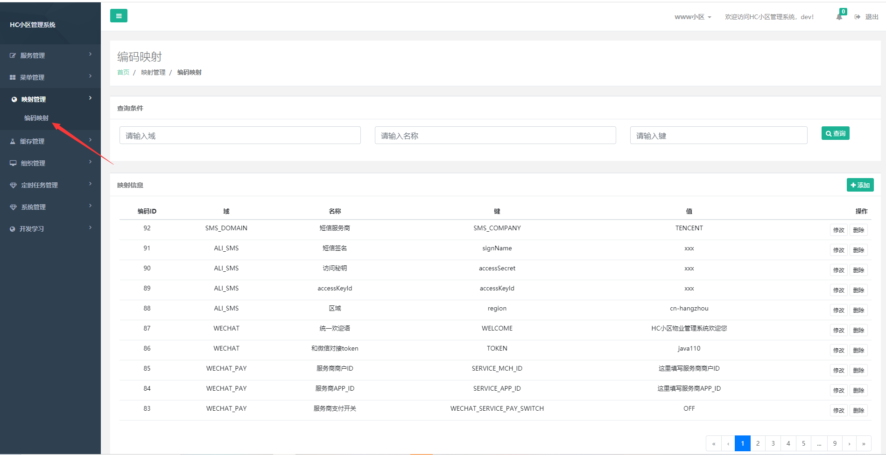

开启验证码功能，搜索键为SMS_SEND_SWITCH的记录将值OFF改为ON

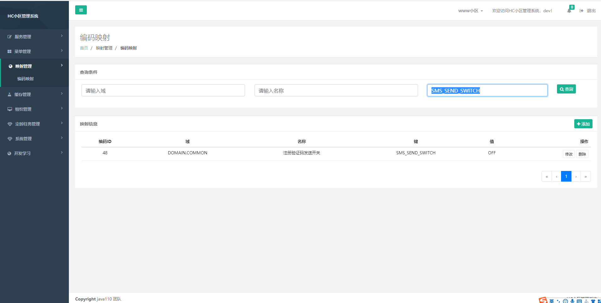

点击修改 域为 SMS_DOMAIN 键为 SMS_COMPANY 的值，阿里为 ALI 腾讯为TENCENT

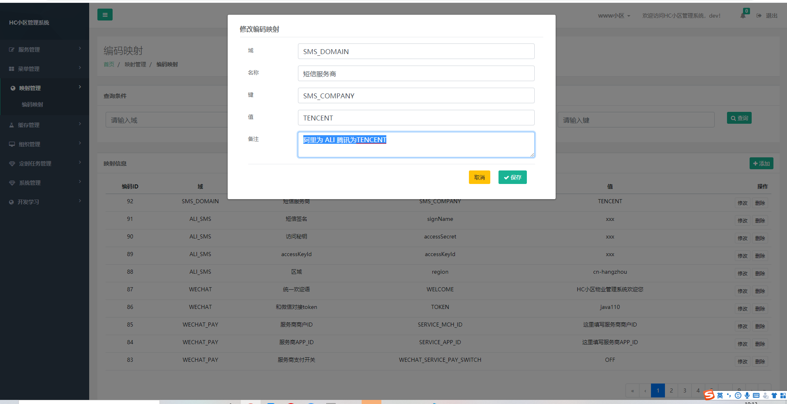

#### 阿里云短信配置

修改域为ALI_SMS 的记录

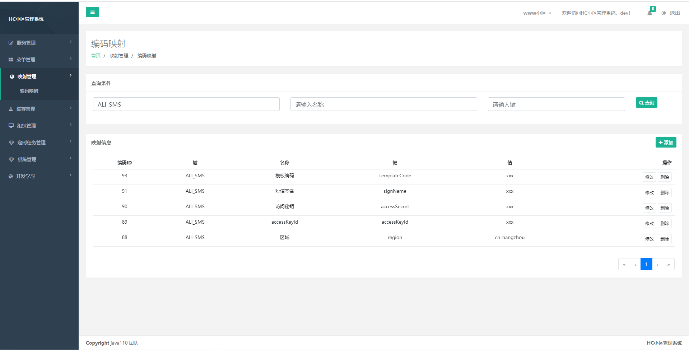

#### 腾讯云短信配置

修改域为TENCENT_SMS 的记录

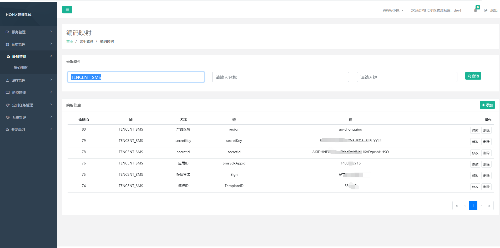

secretId 和 secretKey 如下图获取

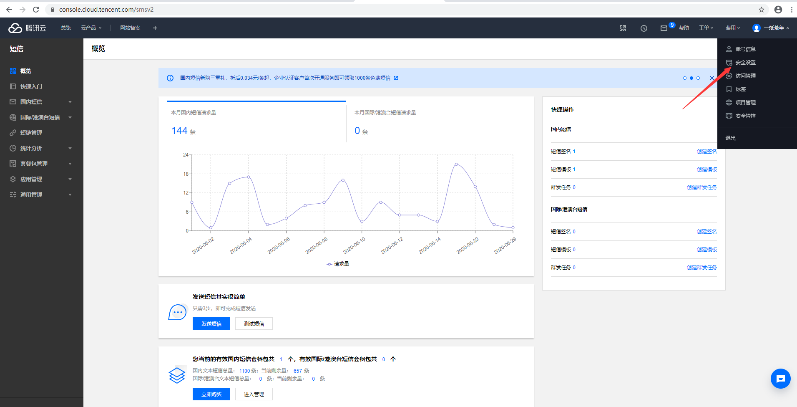

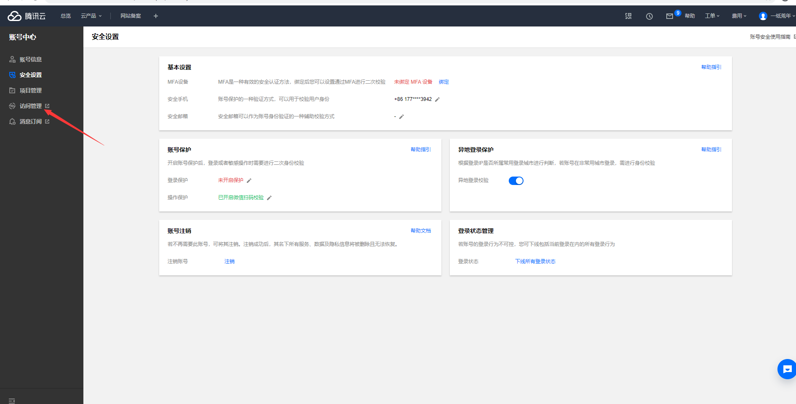

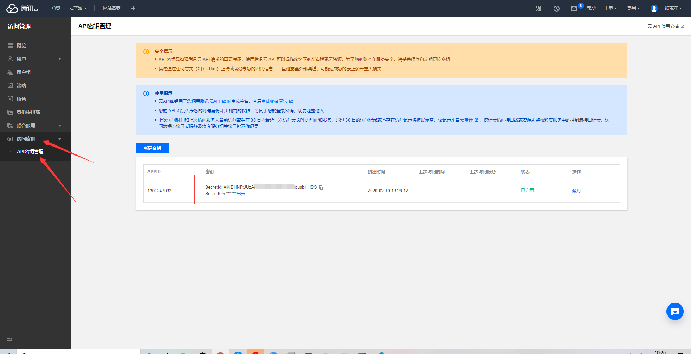

## 业主版小程序安装

#### 1、需要工具

小程序安装使用 需要准备 HBuildX和微信开发者工具，请到相应网站下载

#### 2、HBuildX 设置

由于小程序时通过uni-app 开发而成，编译时需要sass 和 less 请在HBulidX 工具 --> 插件安装安装 less 和 sass

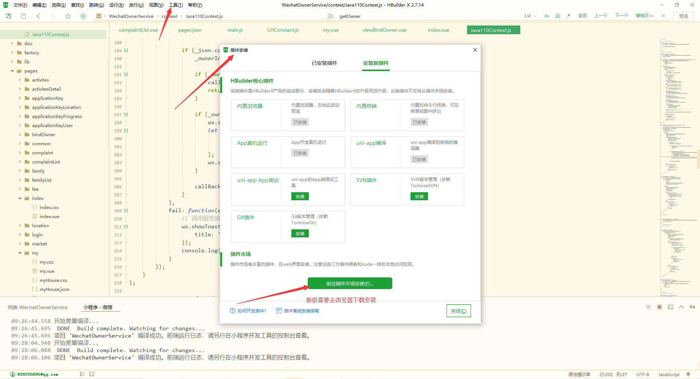
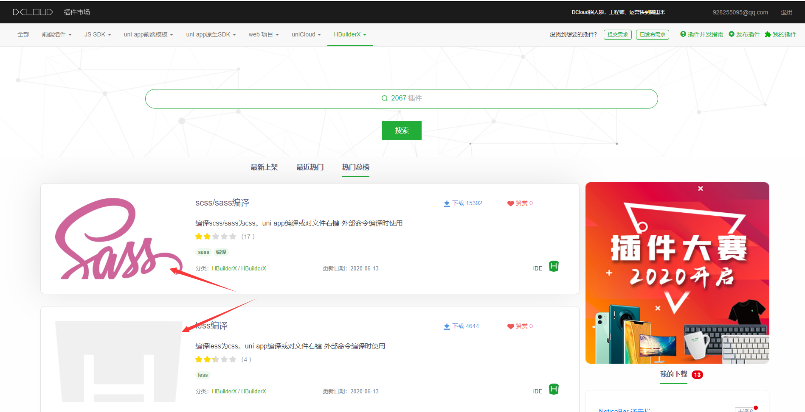
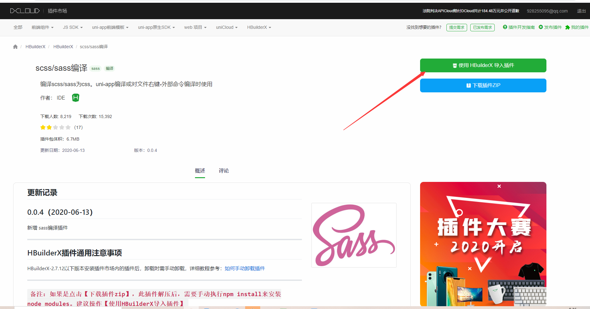

#### 3、微信开发者工具设置

进入微信开发者工具后 可能项目中的appId 为官方测试appId 需要再详情 点击修改为自己的小程序appId

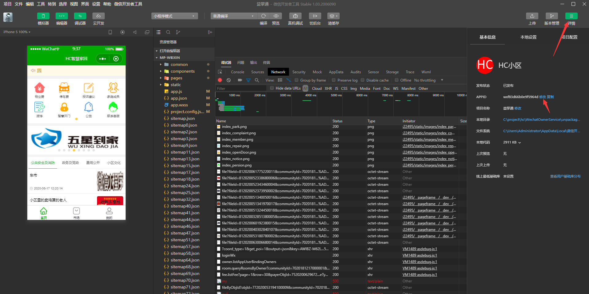

再设置-->通用设置 下安全选项中开启服务端口

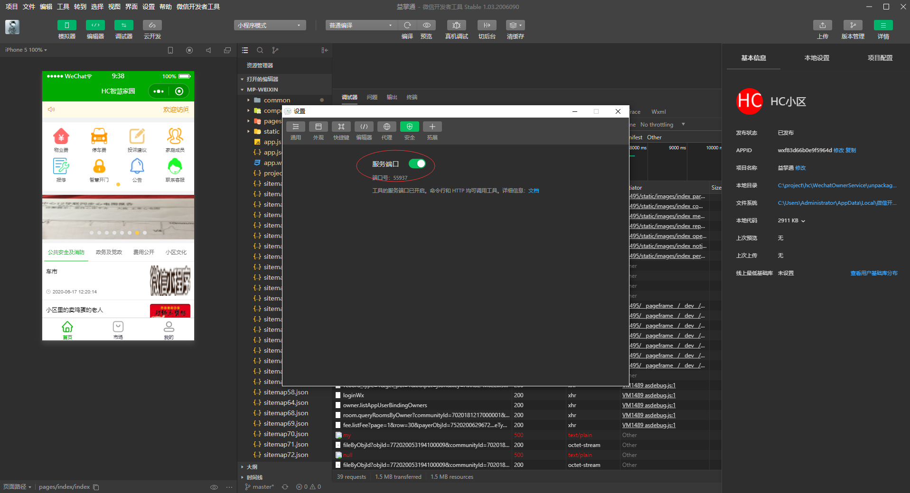

#### 4、业主版代码相关设置

打开constant--> UrlConstant.js 中修改 

> const baseUrl = 'https://app.demo.winqi.cn/';

这里地址修改为自己后端的地址 这个地址需要HTTPS 域名备案才行

在运行--> 运行到小程序模拟器

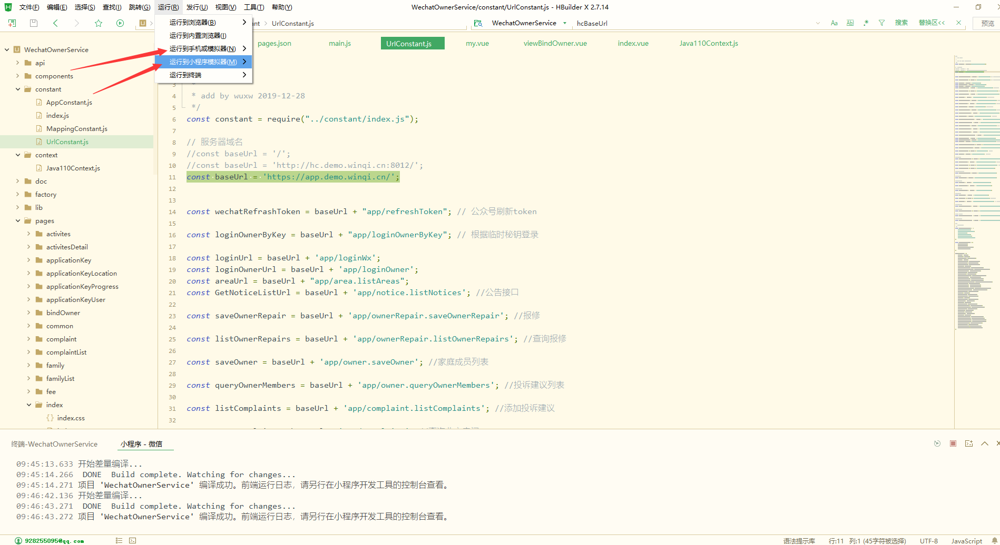

此时在小程序开发者工具上已经运行出来了，点击 上传 发布


#### 5、HC后台设置小程序信息

打开自己部署的HC项目 登录 并且打开 系统管理下小程序配置 新增或修改一条记录

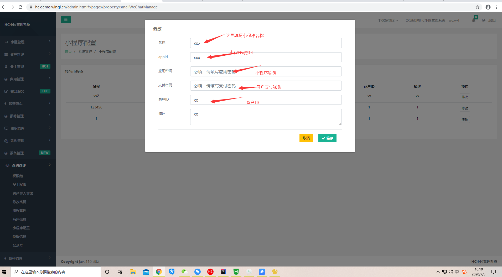


## 业主版公众号安装

#### 说明

公众号代码和小程序代码为一个代码 是uni-app 项目
[https://gitee.com/java110/WechatOwnerService.git](https://gitee.com/java110/WechatOwnerService.git)

#### 1、需要工具

公众号安装使用 需要准备 HBuildX工具，请到相应网站下载

#### 2、HBuildX 设置

由于小程序时通过uni-app 开发而成，编译时需要sass 和 less 请在HBulidX 工具 --> 插件安装安装 less 和 sass


#### 3、业主版代码相关设置

打开constant--> UrlConstant.js 中修改 

> const baseUrl = '/';

这里修改为 / 部署时 会放到NGINX目录下 不然会夸域

#### 4、打开 HC小区管理系统-->系统管理下-->公众号 菜单

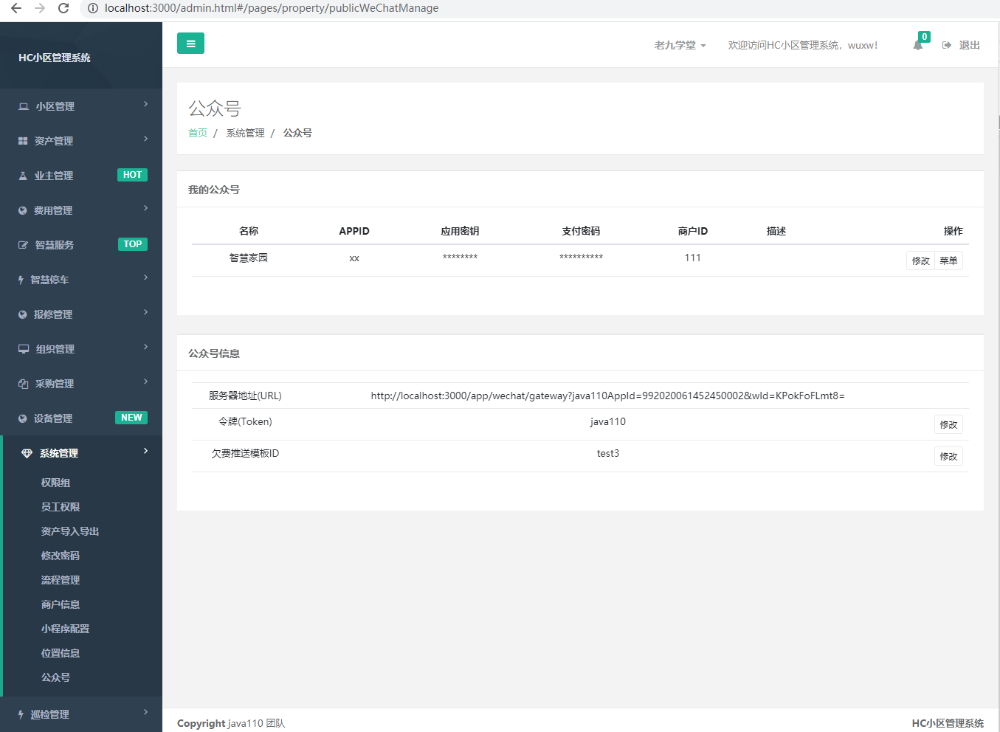

添加或修改公众号，以下为必填信息


添加成功后会有服务端url和token 需要配置在微信后台

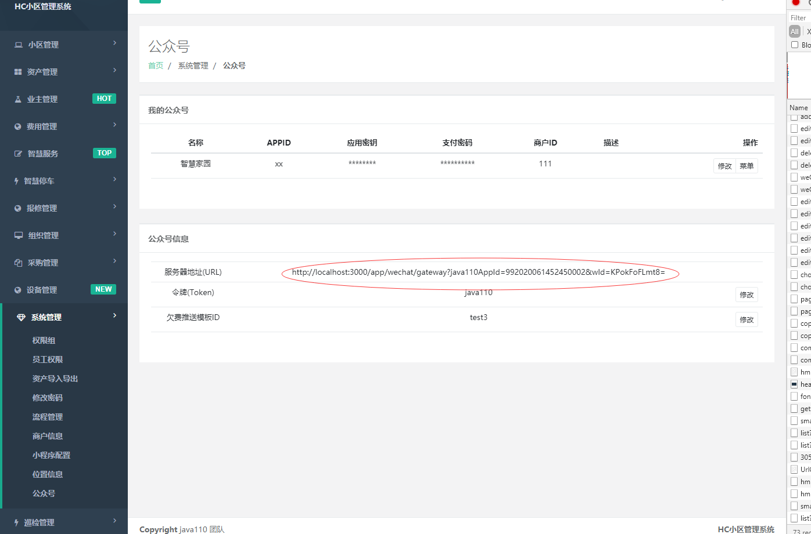

再微信公众号后台 开发--> 基本配置 修改服务器配置，启用就可以


#### 5、再HBuildX 打包为H5 上传服务器 用NGINX代理 到跟目录就可以

在HBuildx 发行菜单下选择 网站H5手机版 并填写域名和网站名称信息，点击发行，打包成功后会在命令行中显示地址

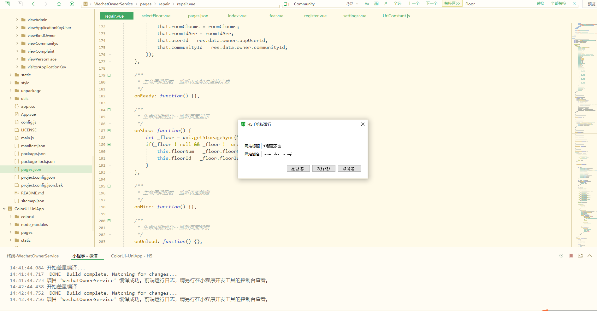


如果是二级域名和HC的设置的域名不一致请在NGINX代理时 加如下配置

>location /callComponent
 {  
   add_header 'Access-Control-Allow-Origin' '*';  
   proxy_pass   http://您的私网IP:8012;
 }
> location /app
> {  
   add_header 'Access-Control-Allow-Origin' '*';  
   proxy_pass   http://您的私网IP:8012;
> }

#### 6、配置微信菜单

菜单配置完全按照微信要求配置，这里配置完发布时会同步微信，同步时的报错也是微信反馈信息，目前只支持 url方式和小程序方式
其他请自行二次开发扩展

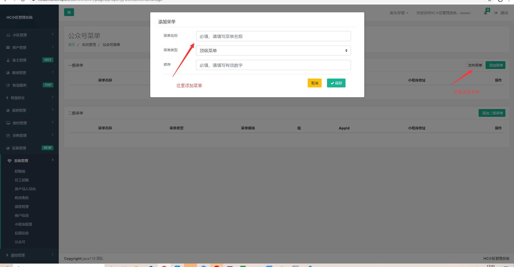


