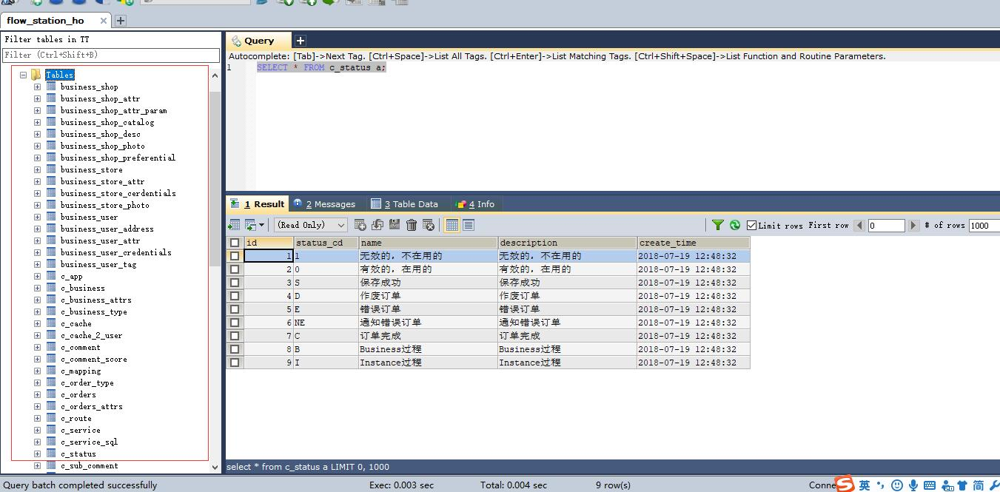

### 变更历史
版本|变更内容|变更时间|变更人员
:-: | :-: | :-: | :-:
v0.01|初稿|2018-07-24|wuxw

### 本页内容

生产环境用docker方式安装代码

## 生产环境部署

    这里推荐用docker 安装

#### 下载代码

```
  git clone https://github.com/java110/MicroCommunity.git
```


#### mysql 安装

切换目录到

```

cd MicroCommunity/java110-config/docker/mysql

docker build -t java110/docker-mysql .

```


```
  docker run -ti --name mysql_test -e MYSQL_ROOT_PASSWORD=123456 -p3306:3306 -idt java110/docker-mysql:latest

  docker logs -f mysql_test

```
出现如下图安装成功


用工具登录 如下图：




安装完成

#### redis 安装

```
docker pull redis
docker run -ti --name redis_test -p6379:6379 -idt redis:latest
docker logs -f redis_test
```


#### zookeeper 安装

```
docker pull zookeeper
docker run -ti --name zookeeper_test -p2181:2181 -idt zookeeper:latest
docker logs -f zookeeper_test
```


#### kafka 安装

```
docker pull wurstmeister/kafka
docker run --name kafka_test -e HOST_IP=localhost -e KAFKA_ADVERTISED_PORT=9092 -e KAFKA_BROKER_ID=1 -e KAFKA_ZOOKEEPER_CONNECT=192.168.31.199:2181 -e KAFKA_ADVERTISED_HOST_NAME=localhost -e ZK=zk -p 9092 --link zookeeper_test:zk -tdi wurstmeister/kafka
docker logs -f kafka_test
```


注意 KAFKA_ZOOKEEPER_CONNECT=192.168.31.199:2181 换成自己主机的IP端口

#### 编译代码

配置hosts
dev.java110.com 您的eureka服务IP
dev.redis.java110.com 您的redis服务器IP
dev.zk.java110.com 您的zookeeper服务器IP
dev.db.java110.com 您的mysql服务器IP
dev.kafka.java110.com 您的kafka服务器IP
api.java110.com 您的api服务服务器IP

修改 MicroCommunity/XXService/src/main/resources 下的application-dev(开发环境) application-prod(生产环境) application-test(测试环境) 中的数据库地址 kafka地址 zookeeper地址 redis地址等

XXService 代表 CenterService，CodeService，CommentService，ConsoleService，ShopService,StoreService,UserService 等

```
mvn clean install
```


第一次编译需要下载jar 时间有点长

#### 启动服务

修改 reBuildAll.sh 中的 #docker-compose -f ./eureka/docker/docker-compose.yml       up -d --build --force-recreate;

删除注释 # 号

执行命令

```
    sh reBuildAll.sh
```

开始构建代码启动服务

目前为止全部启动完成


