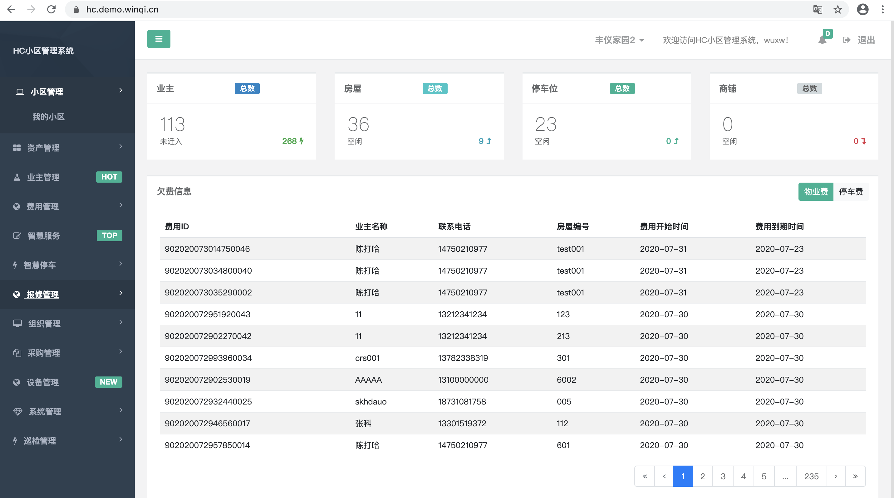
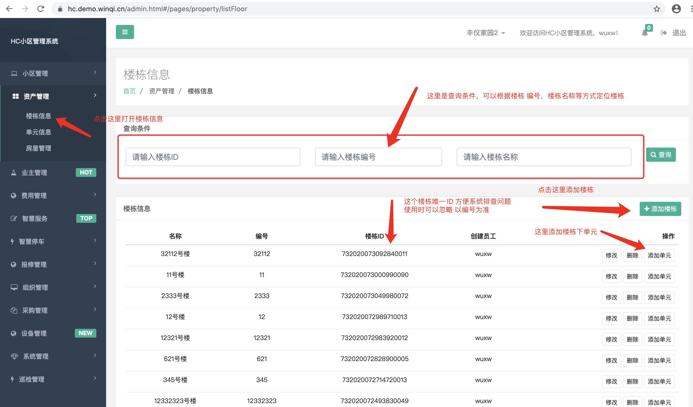
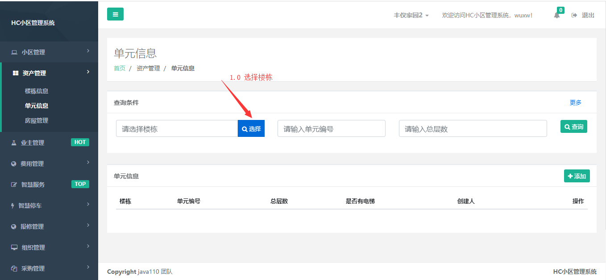
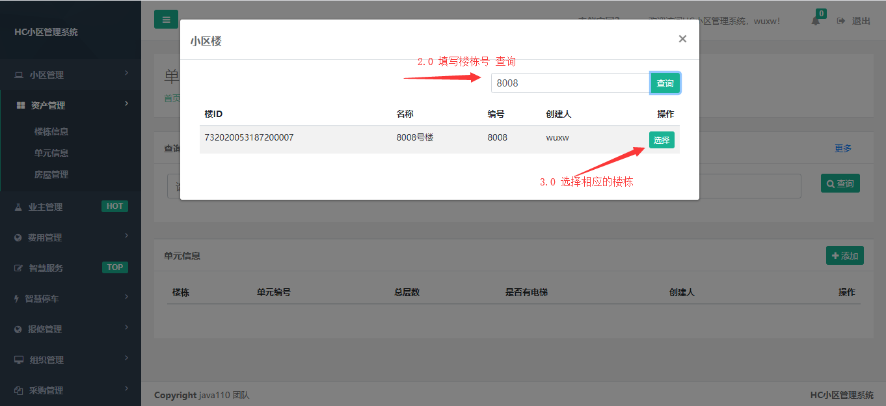
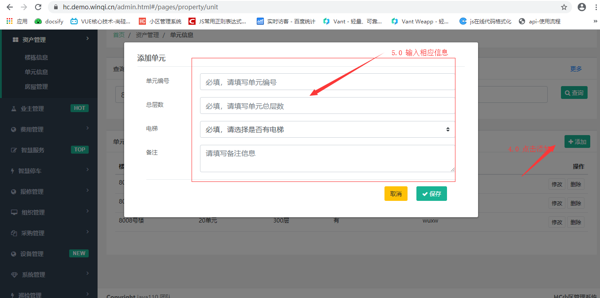
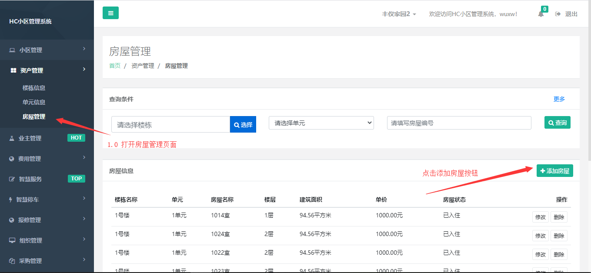
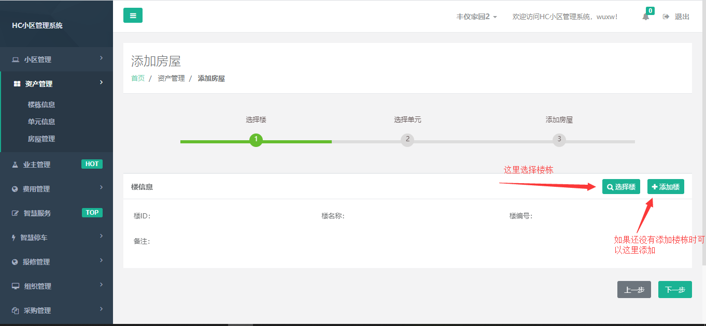
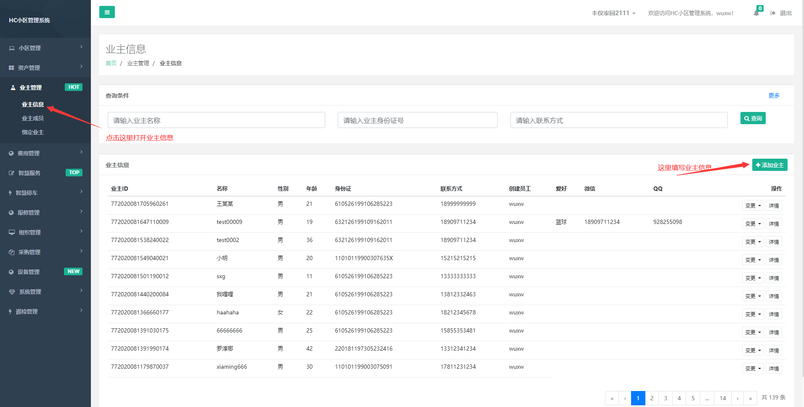
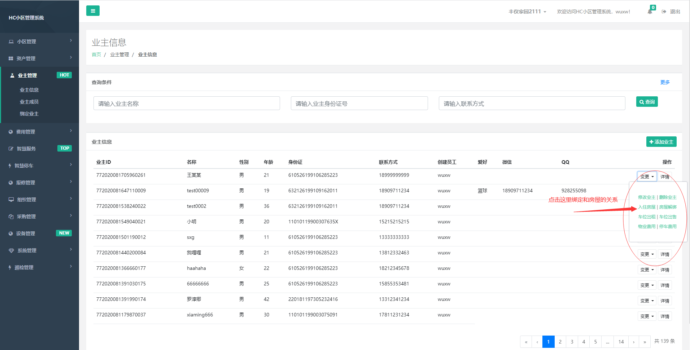

## 2.5.1 说明

资产管理主要管理 小区楼栋 单元 房屋 车位 信息的管理维护，系统初始化时建议采用资产导入的方式导入，人工录入工作量比较大

## 2.5.2 添加楼栋

通过2.1.4 物业账号注册 步注册出来的账号登录hc小区管理系统，演示环境物业测试账号为wuxw/admin

打开菜单 资产管理 我们可以看到下面有 楼栋信息，单元信息，房屋管理

## 2.5.3 添加单元

单元可以在楼栋页面添加，也可以 “资产管理” --> 单元信息页面添加

## 2.5.4 添加房屋

添加房屋时，必须确保已经添加了房屋对应的楼栋和单元，点击“资产管理”--> 房屋管理 点击添加

## 2.5.5 添加业主

业主信息 我们可以通过系统管理中的资产导入方式 导入，也可以在业主管理中的业主信息中添加业主，业主

注意，家庭中的其他成员 如 租客 妻子 丈夫 孩子等都可以完善到业主成员中

## 2.5.6 业主绑定房屋

目前业主绑定房屋是通过业主管理 -> 业主信息->变更->入住房屋 ，点击后选择房屋选择业主 即可绑定

