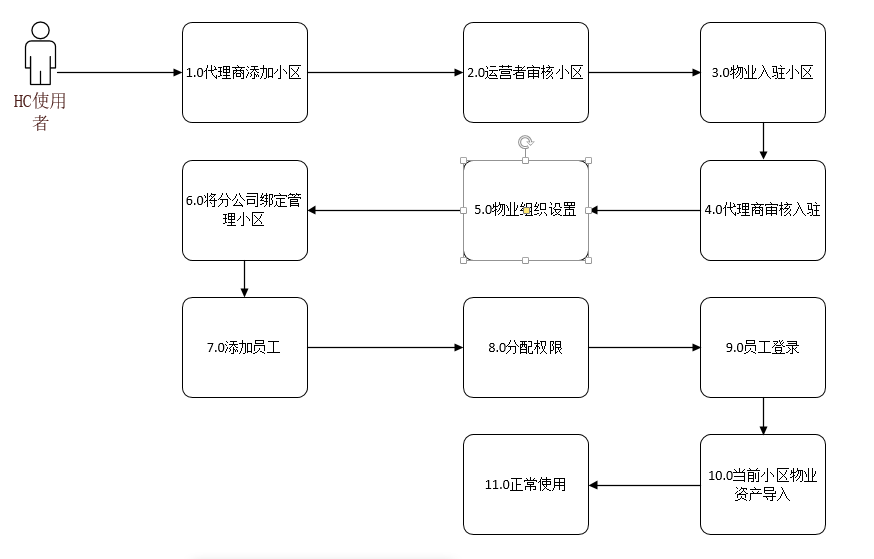

## 1.2.1 说明

主要说明HC小区管理系统物业使用流程和注意事项，有任何问题发邮件交流 928255095@qq.com

## 1.2.2 流程图

#### 1.0 代理商添加小区

代理商用户（系统演示代理商账号为dails/admin,也可以自己注册新账号）打开“小区管理”--> 小区信息 菜单添加小区并且完善如小区
名称、小区地址和小区地区等信息，提交运营团队审核 具体流程请查看 2.1 物业入驻平台

#### 2.0 运营者审核小区

目前 运营者只参与小区添加的审核管理(账号为admin/admin 系统默认账号无法注册新账号)，也就是 代理商的管理，具体物业的信息 尽量让代理商去做管理，如果你不想用代理商这个角色
也是可以的，运营者也是有添加小区的功能，这样物业入驻时也是需要运营者审核 具体流程请查看 2.1 物业入驻平台

#### 3.0 物业入驻小区

物业通过注册页面 先注册账号后，再去登录页面用注册的账号登录时 就会跳转至完善商户信息页面，再该页面中完善商户信息并且提交就会跳转
至首页，此时还没有入住小区时，物业账号很多功能无法操作，需要入驻小区才能操作，点击“小区管理”--> 我的小区页面入驻小区

#### 4.0 代理商审核入驻

代理商登录系统（系统演示代理商账号为dails/admin,也可以自己注册新账号）审核物业入驻小区，在小区管理 --> 审核商户，根据商户信息 审核通过
或者不通过，具体操作请查看2.1.7 代理商入驻审核

#### 5.0 物业组织设置

物业组织管理目前分为 总公司级 和 分公司级，总公司是集团物业，分公司是各个小区物业，理论上我们会为每一个小区建立一个分公司，然后将该小区
绑定给该分公司，该分公司下的员工就能管理该小区，具体操作请查看2.2 组织和权限

#### 6.0 将分公司绑定管理小区

为每个分公司绑定相应的小区，如果一个物业团队管理 多个小区，就给他绑定相应的小区 具体操作请查看2.2 组织和权限

#### 7.0 添加员工

目前 我们的员工只能添加到部门上，也就是分公司下部门下，添加员工后登录账号为名称 密码为123456 登录后请及时修改密码，员工所拥有的小区是
他上层分公司所拥有的小区  具体操作请查看2.2.5 添加员工

#### 8.0 分配权限

权限分为权限组和权限，我们建议为每个部门或者群体 优先建立权限组，员工赋权时直接权限组。具体操作查看 2.2.6 和 2.2.7

#### 9.0 员工登录

添加员工默认账号 为员工名称 密码为123456 该密码根据平台开发者账户定义有所不同，目前演示环境为123456 员工登录后尽快到系统管理-->
修改密码，根据8.0 分配权限 员工只能看到分配了权限的菜单，其他的菜单无权操作

#### 10.0 当前小区物业次产导入

员工打开系统管理--> 资产导入导出 下载模板 模板中包含了 楼栋单元 业主信息 费用设置 房屋信息  车位信息 等功能需要物业人员
根据excel 要求填写整理数据，然后在资产导入处导入，这样小区中的信息导入成功 可以正常缴费使用

