## 2.1.1 说明

## 2.1.2 添加小区

#### 1、 打开地址https://hc.demo.winqi.cn/ ，输入代理商账号（dails）、密码（admin）和验证码登录。

#### 2、 点击“小区信息”后“添加小区”。

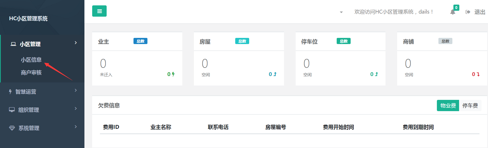

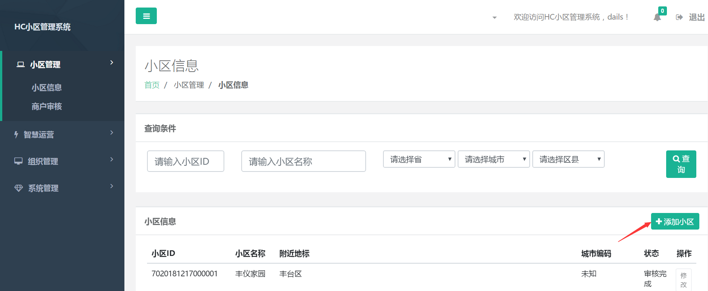

#### 3、 输入小区名称、小区地区、小区地址等小区信息后，点击保存，小区即添加成功，添加成功的小区可在“小区信息”查看审核状态和修改信息。

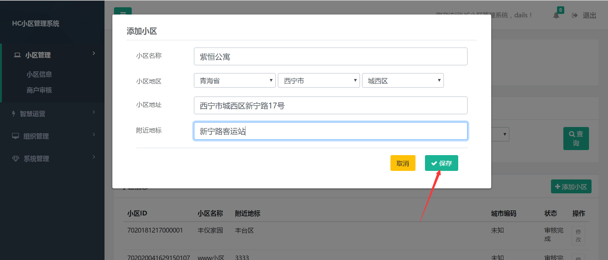

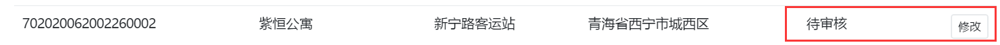

## 2.1.3 审核小区

#### 1、 打开地址https://hc.demo.winqi.cn/ ，输入管理员账号（admin）、密码（admin）和验证码登录。

#### 2、 点击“审核小区”进入小区审核页面。

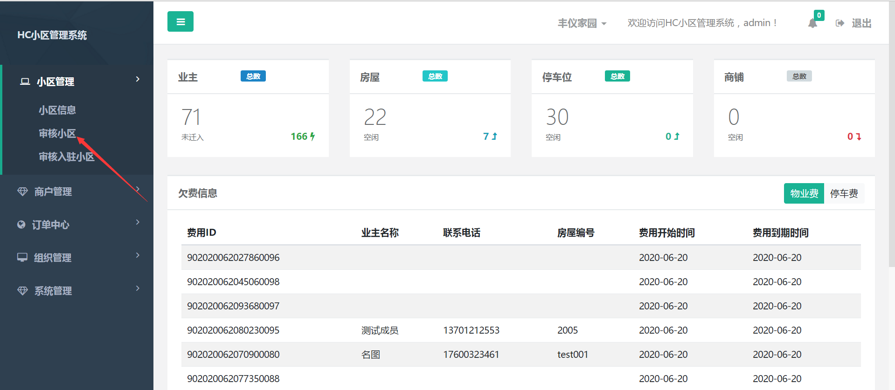

#### 3、 点击“审核”，输入审核信息，提交后小区即审核成功。

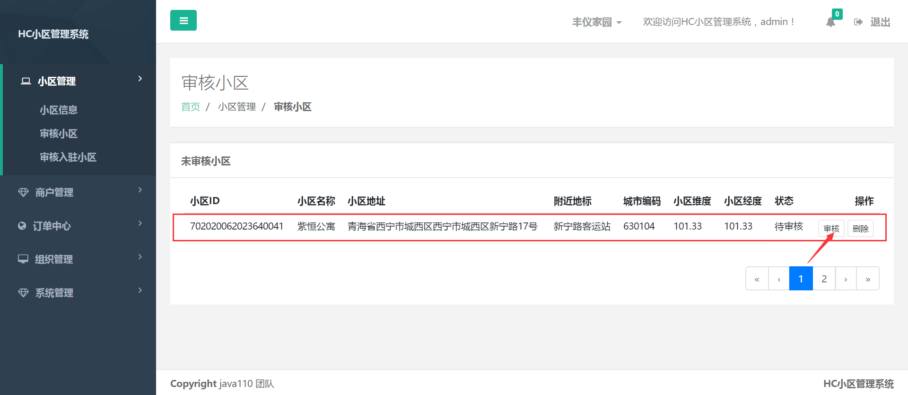

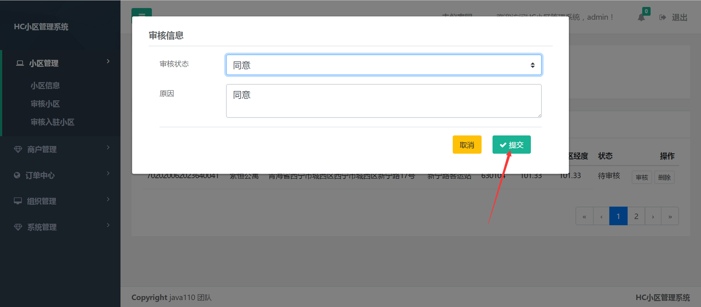

#### 4、 代理商可在小区信息查看审核完成的小区信息，并可修改和撤回审核。

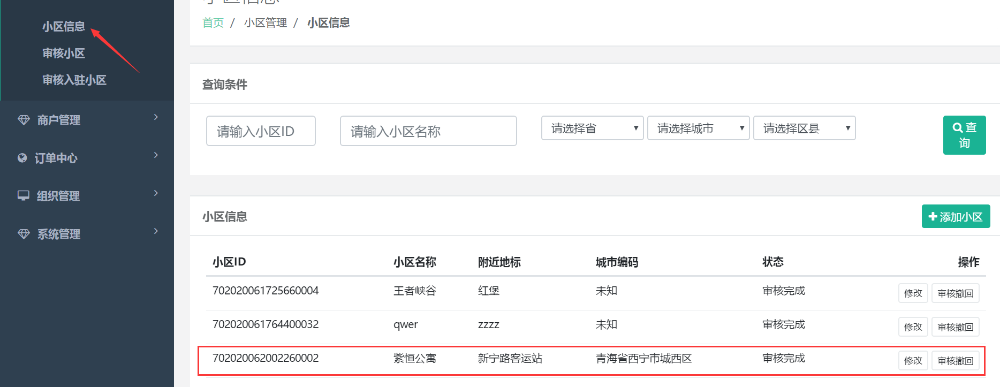

## 2.1.4 物业账号注册

#### 1、 打开地址https://hc.demo.winqi.cn/ ，点击注册。

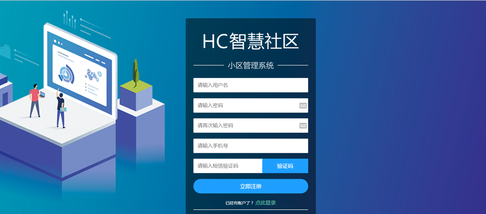

## 2.1.5 物业信息完善

#### 1、登陆物业账号，完善公司信息。

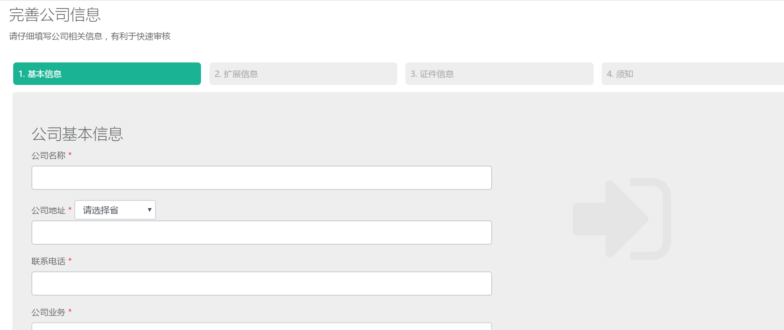

#### 2、依次填写完公司详细信息后，勾选“我同意并遵守以上信息”，点击“提交”，直接跳转到管理系统。

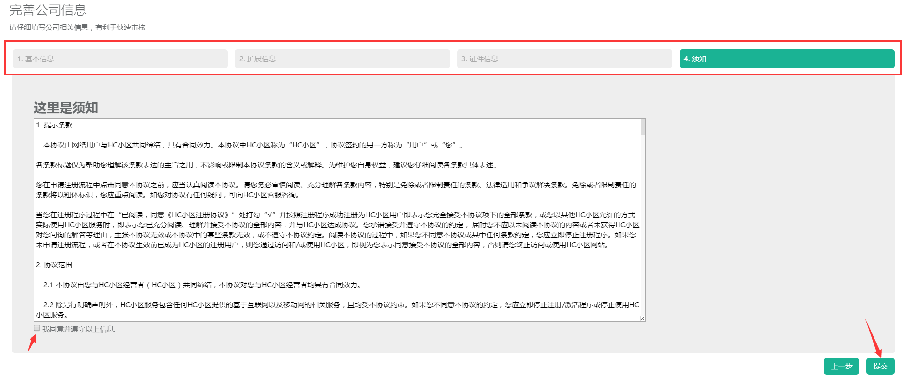

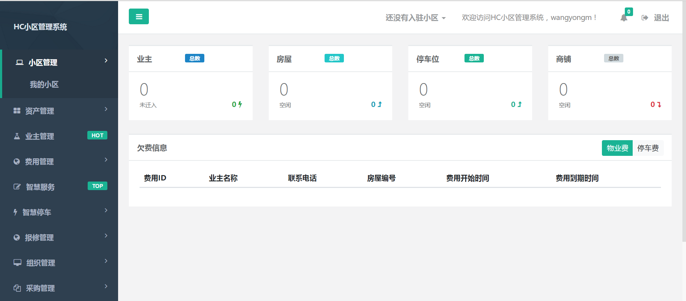

## 2.1.6 物业入驻

#### 1、在管理系统点击我的小区进行小区入驻。

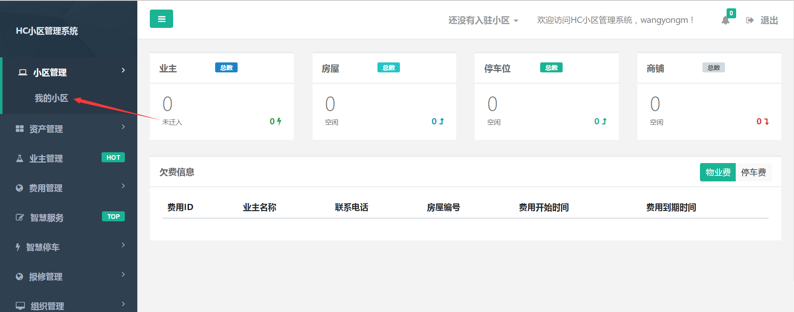

#### 2、点击入驻小区，选择小区申请入驻。

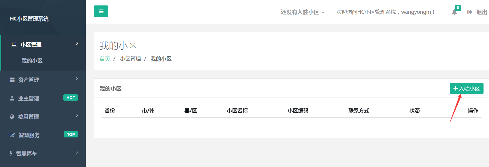

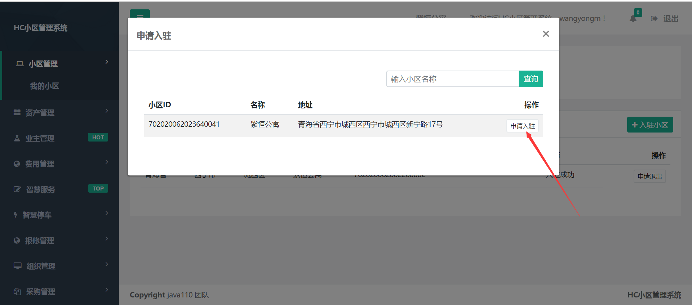

#### 3、小区状态显示“入驻审核”。

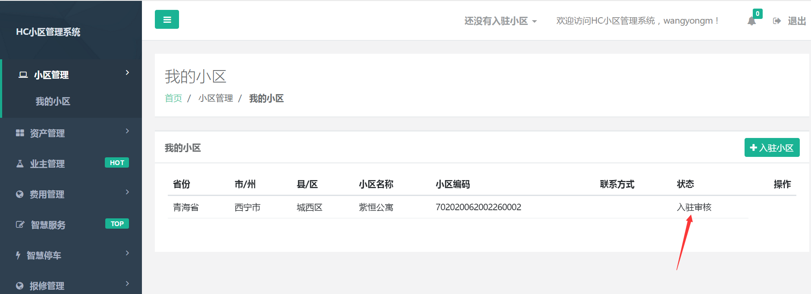

## 2.1.7 入驻审核

#### 1、 打开地址https://hc.demo.winqi.cn/ ，输入代理商账号（dails）、密码（admin）和验证码登录。

#### 2、点击“商户审核”审核物业入驻。

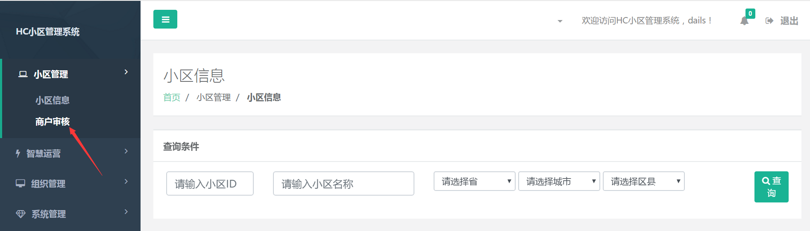

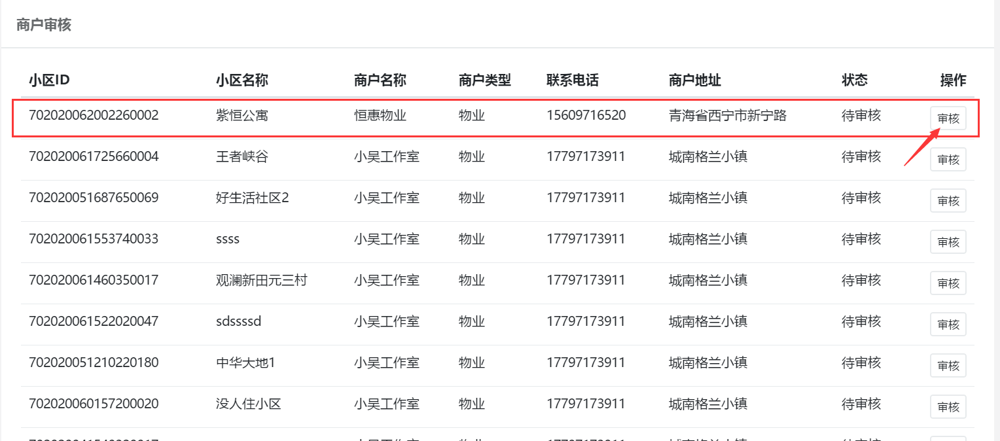

#### 3、点击“审核”，选择审核同意后点击“提交”，物业入驻成功。

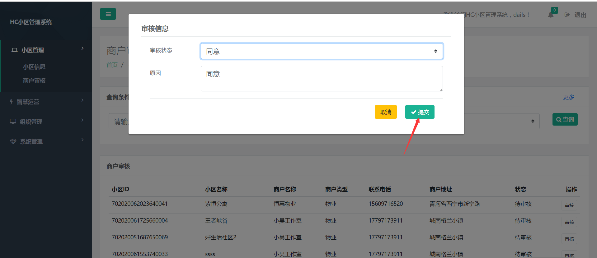

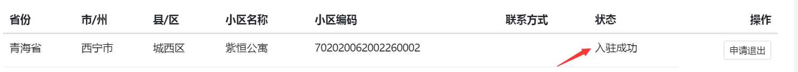

## 2.1.8 资产导入

