## 2.3.1 说明

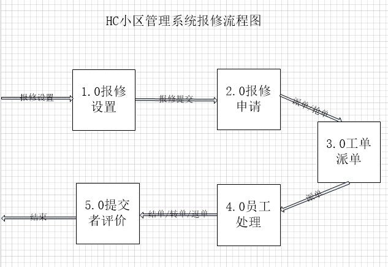

#### 1.0 报修设置

在报修管理-> 报修设置 中设置报修类型信息，包括类型名称，派单方式，公共区域，收费情况，回访设置 等，
后期报修单流转都是根据这里的设置，例如派单方式分为 抢单 指派 和轮训 
>抢单为报修师傅可以抢单报修，可以线下规定每单报修的提成，提高报修师傅的积极性
>
>指派为专门有人员手工将报修单指派给相应员工处理，比较灵活
>
>轮训为系统自动轮训给报修师傅派单

在报修设置中设置相应师傅

#### 2.0 报修申请

报修申请分为两种，电话报修和手机端微信报修，手机端请打开相应小程序或公众号，官方演示环境公众号为 HC智慧家园公众号
填写报修信息，选择报修类型，提交报修单

#### 3.0 工单派单 

工单派单分为3中 抢单 指派 和轮训 具体逻辑请看1.0 报修设置，根据设置派单

#### 4.0 员工处理

员工处理分为 退单，转单，结单

> 退单为 订单拍错了等原因无法处理，需要退回给 提交人确认
>
>转单为 请假了，出差了或者订单拍错了等原因无法处理需要转给相应的同事处理
>
>结单为 我已经处理完成 需要提交人（业主）确认

#### 提交者评价

订单结单后，需要提交者评价处理，是否满意，不满意可以将维修单退回给 维修师傅继续处理，如果本次存在一定的维修费用，
还需要提交者支付，如果是电话报修，需要提交员工联系员工到物业前台缴费，手机维修时在线支付就可以

#### 回访

回访员工根据工单池状态进行回访维修满意情况

## 2.3.2 报修设置

#### 1、 打开地址https://hc.demo.winqi.cn/ ，输入物业账号、密码和验证码登录。

#### 2、 添加报修类型。依次点击左侧菜单栏“报修管理—报修设置”，点击如图“添加”添加报修类型。

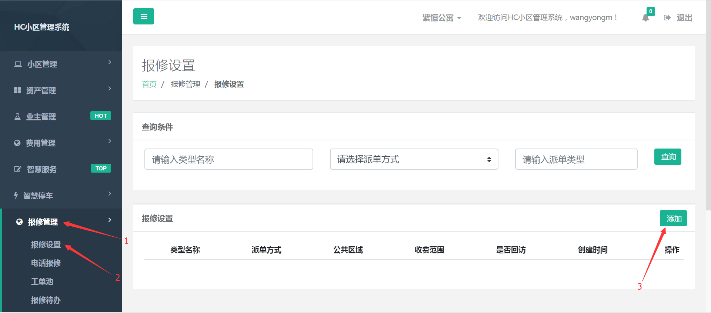
       
         填写报修设置信息后点击保存，报修添加成功。

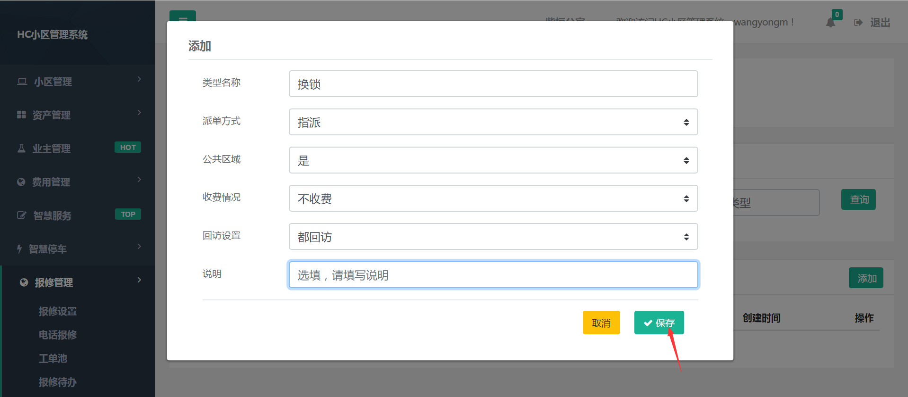
       
         页面跳转如下，物业可以对添加的报修类型执行修改、报修师傅、删除等操作。

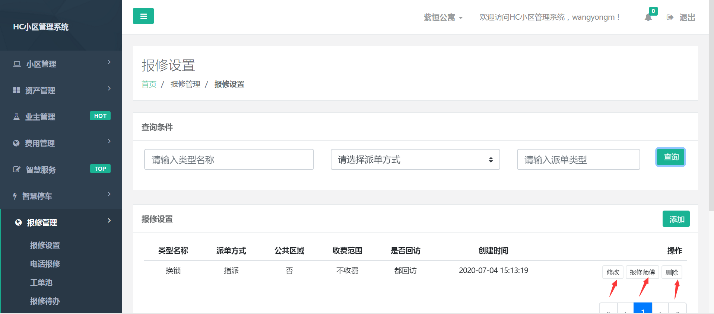

#### 3、报修师傅设置。依次点击左侧菜单栏“报修管理—报修设置”，点击如图“报修师傅”设置报修师傅。

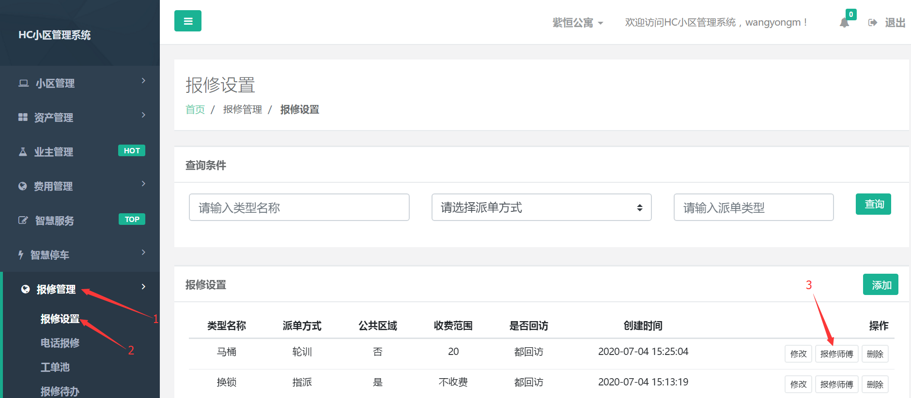
  
        点击“添加”，选择相应维修师傅。

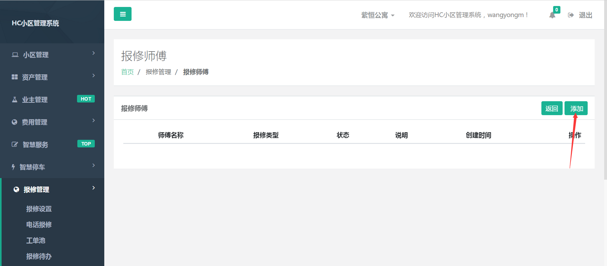

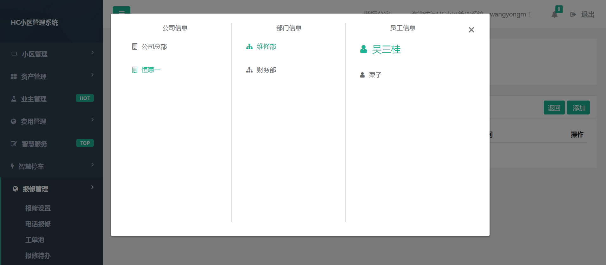

        维修师傅可多次添加，添加成功的维修师傅显示如下图，物业可对维修师傅进行“删除”、“变更操作”。

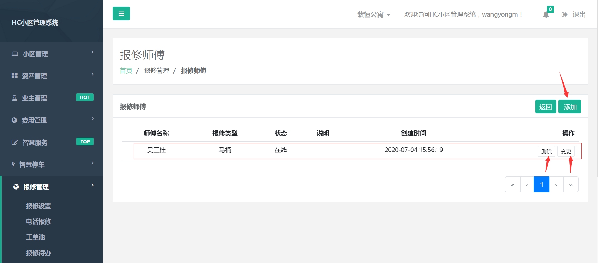

## 2.3.3 电话报修录单

#### 1、 物业接到电话报修后，依次点击左侧菜单栏“报修管理—电话报修”，点击如图“登记”进行电话报修录单。

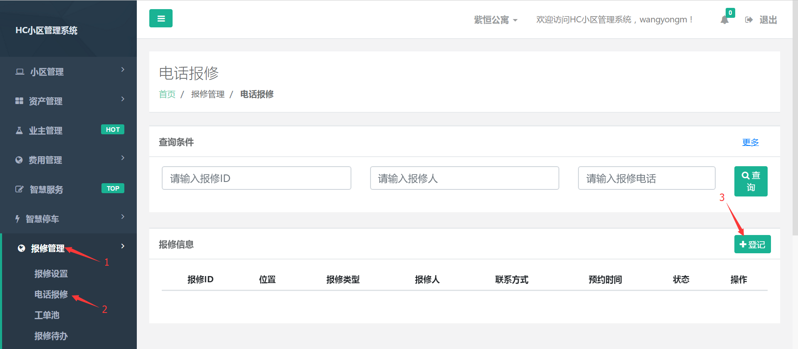

#### 2、 填写报修信息，点击“提交”。

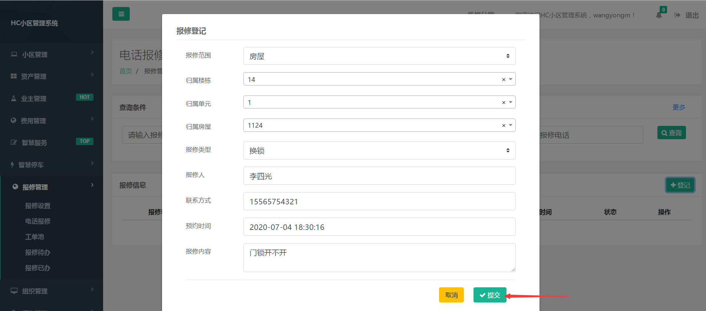

         页面跳转至如下图，物业可对录入的报修单执行“修改”、“删除”操作。

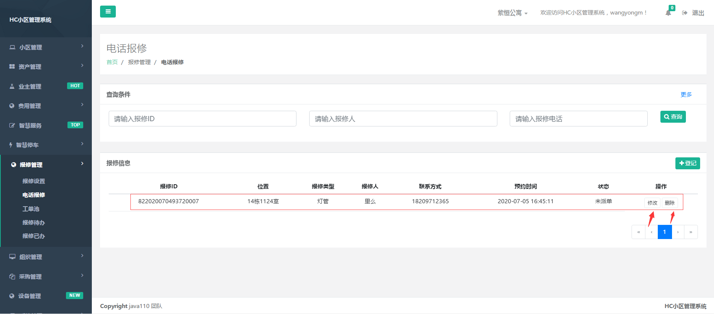

## 2.3.4 业主端报修录单

## 2.3.5 派单

#### 1、 依次点击左侧菜单栏“报修管理—工单池”，点击如图“派单”。

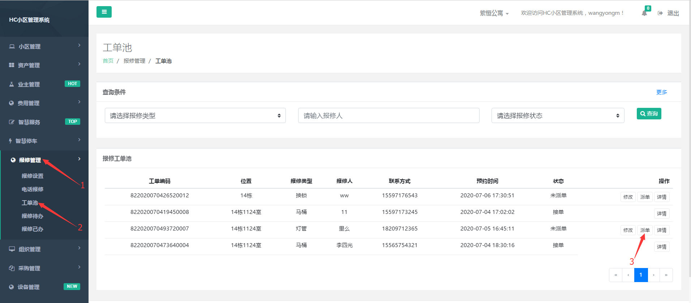

#### 2、填写派单信息后，点击“提交”。

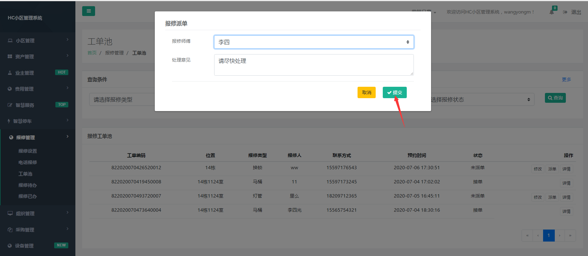

#### 3、工单池状态显示为接单状态，点击“详情”可查看该工单详细信息。

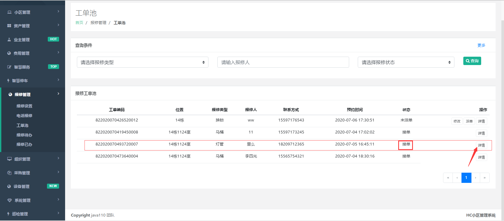

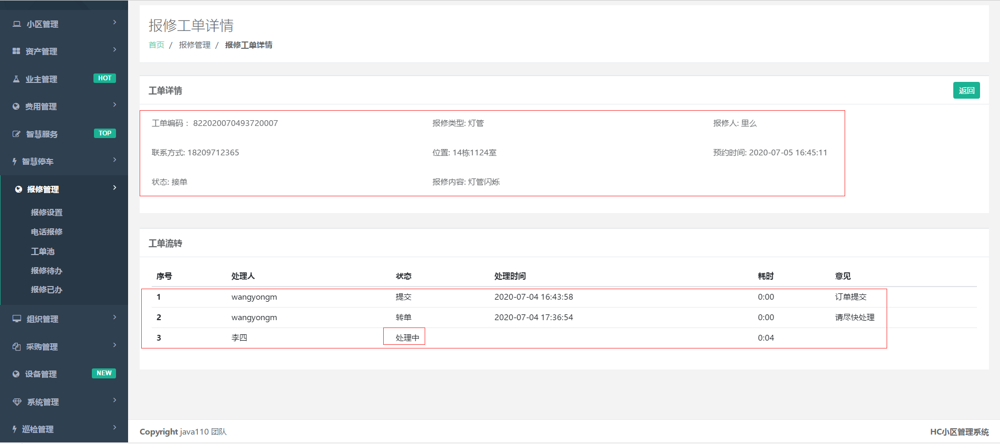

## 2.3.6 订单处理

#### 1、 打开地址https://hc.demo.winqi.cn/ ，输入员工账号、密码和验证码登录。

#### 2、 依次点击左侧菜单栏“报修管理—报修待办”，显示页面如下，维修师傅可对已派工单执行“转单”、“退单”、“办结”操作。

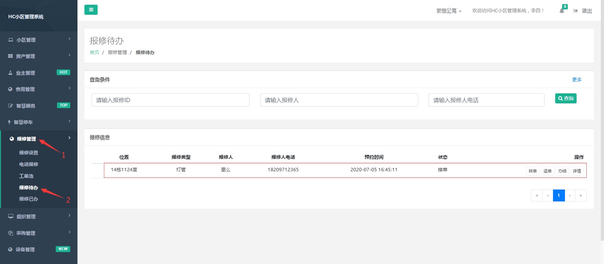

#### 3、点击上图“办结”， 填写结单信息，点击“提交”，订单处理成功，维修订单从“报修待办”转入“报修已办”。

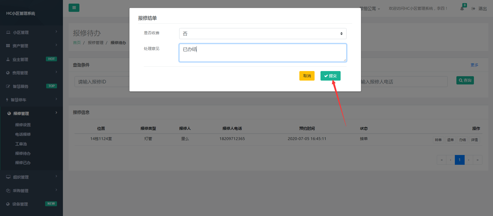

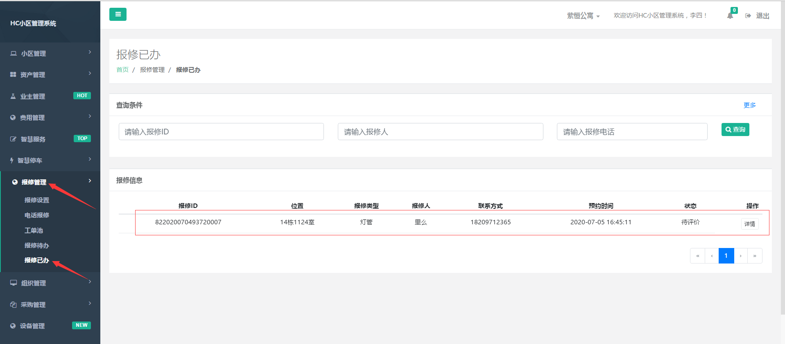

