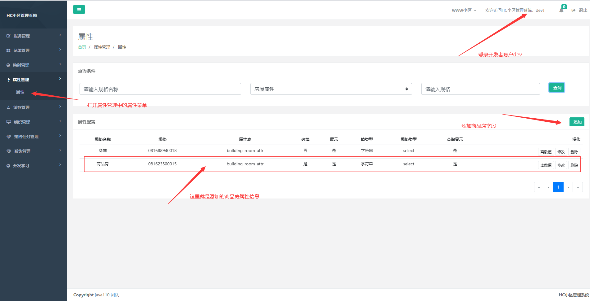
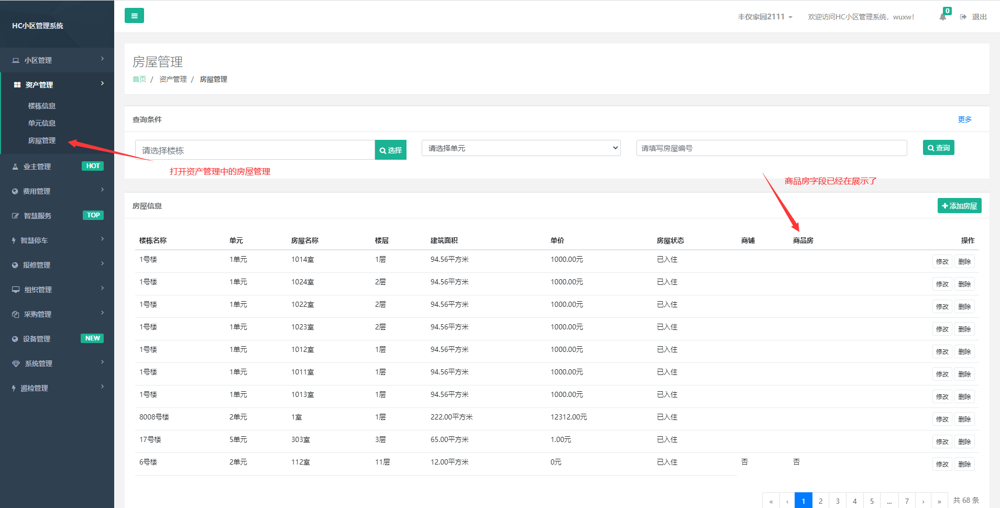
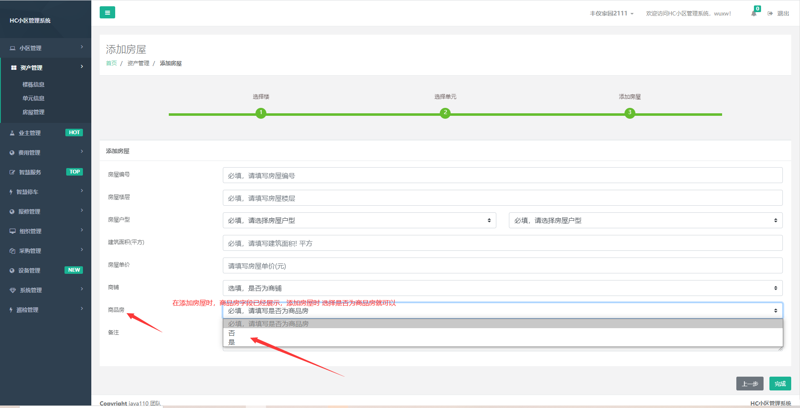

## 4.1.1 说明

在线上使用时，根据不同物业的要求，可能目前HC小区管理系统设计的房屋字段不够使用，物业可能还有其他的信息需要录入
此时我们可以根据属性管理来解决这个问题

## 4.1.2 属性管理

我们将主表中没有包含的字段信息可以放入到属性表中，并且我们将这种信息叫为属性信息，例如房屋 字段 是否为商品房
字段，目前没有一个字段来存放这个信息，我们可以把他称之为房屋属性，然后添加一个属性字段来存放商品房屋

## 4.1.3 添加属性

在 开发者账户（dev）下 属性管理->属性 点击添加添加房屋属性

## 4.1.4 属性展示
在物业账号下查看房屋信息 是否发生变化

## 4.1.5 添加时 展示属性

此时在添加房屋时已经展示了 属性输入框，需要输入属性